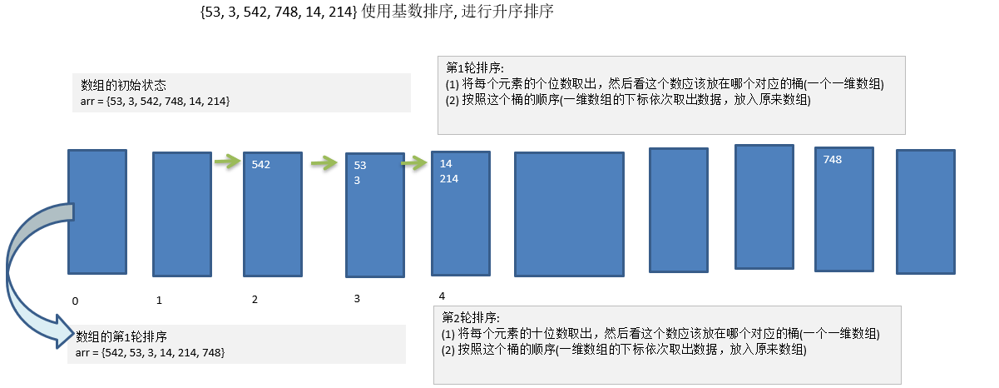
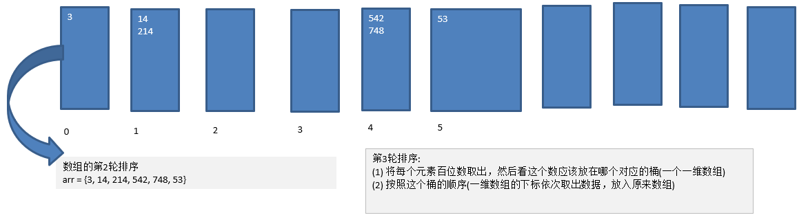
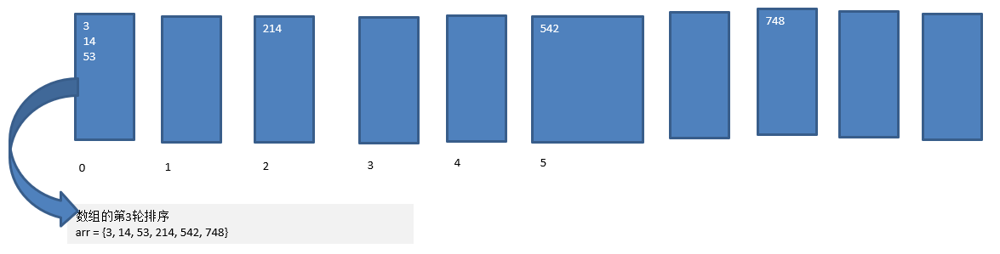

# 基数排序
---
## 基本介绍
1. 基数排序（radix sort）属于“分配式排序”（distribution sort），又称“桶子法”（bucket sort）或 bin sort，顾名思义，它是通过键值的各个位的值，将要排序的元素分配至某些“桶”中，达到排序的作用
2. 基数排序法是属于稳定性的排序，基数排序法的是效率高的 **稳定性(如果两个元素大小相同，排序后他们的先后顺序不变)** 排序法
3. 基数排序(Radix Sort)是桶排序的扩展
4. 基数排序是 1887 年赫尔曼·何乐礼发明的。它是这样实现的：将整数按位数切割成不同的数字，然后按每个位数分别比较。

---
## 图解




---
## 代码实现
```java
/**
 * 使用基数排序对数组进行排序
 * @param array		数组
 */
public static void radixSort(int[] array) {
	// 找出数组中最大的元素的长度
	int maxNumber = findMaxNumber(array);
	int maxNumberLength = String.valueOf(maxNumber).length();

	// 初始化桶
	int[][] bucket = new int[10][array.length];
	// 每个桶中元素的个数
	int[] bucketLength = new int[10];

	int n = 1;
	for (int round = 1; round <= maxNumberLength; round++) {
		// 将元素按照个位数的大小放入相应的桶
		for (int i = 0; i < array.length; i++) {
			// 求出第n位的数,n从后完往前数
			int digit = array[i] / n % 10;

			// 放入相应的桶
			bucket[digit][bucketLength[digit]] = array[i];

			// 相应的桶的元素+1
			bucketLength[digit] = bucketLength[digit] + 1;
		}

		n *= 10;

		// 将桶中的元素按照顺序拷贝到原始数组
		int arrayIndex = 0;
		for (int i = 0; i < bucketLength.length; i++) {
			// 当前桶中存在元素
			if (bucketLength[i] > 0) {
				int currentBucketLength = bucketLength[i];
				int currentBucketIndex = 0;
				while (currentBucketIndex < currentBucketLength) {
					array[arrayIndex] = bucket[i][currentBucketIndex];
					arrayIndex += 1;
					currentBucketIndex += 1;
				}
			}

			// 重置桶中元素的个数
			bucketLength[i] = 0;
		}
	}

}

/**
 * 查找数组中最大的数
 * @param array	数组
 * @return		数组中最大的数
 */
private static int findMaxNumber(int[] array) {
	return Arrays.stream(array).max().getAsInt();
}
```

---
## 基数排序注意事项
1. 基数排序是对传统桶排序的扩展， **速度很快**。
2. 基数排序是经典的空间换时间的方式，占用内存很大, 当对海量数据排序时， **容易造成 `OutOfMemoryError`** 。
3. 基数排序时稳定的。[注:假定在待排序的记录序列中，存在多个具有相同的关键字的记录，若经过排序，这些记录的相对次序保持不变，即在原序列中， **r[i]=r[j]，且 r[i]在 r[j]之前，而在排序后的序列中，r[i]仍在 r[j]之前， 则称这种排序算法是稳定的；否则称为不稳定的** ]
4. **有负数的数组，我们不用基数排序来进行排序** , 如果要支持负数，参考: https://code.i-harness.com/zh-CN/q/e98fa9
