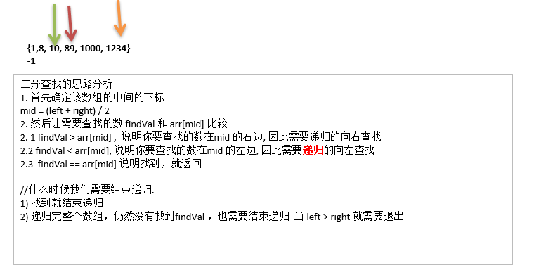

# 二分查找算法
---
## 需求
请对一个有序数组进行二分查找 `{1,8, 10, 89, 1000, 1234} `，输入一个数看看该数组是否存在此数，并且求出下标，如果没有就提示"没有这个数"。

---
## 思路图解


---
## 代码实现
```java
/**
 * 二分查找
 * @param array			排好序的数组
 * @param searchValue	查询的值
 * @param left			左索引
 * @param right			右索引
 * @return				查询到的下标
 */
public static List<Integer> binarySearch(int[] array, int searchValue, int left, int right) {
	// 未找到查询的值
	if (left > right) {
		return new ArrayList<>();
	}
	// 获取中间值
	int midIndex = (left + right) / 2;
	int midValue = array[midIndex];

	// 大于中间值,向右递归
	if (searchValue > midValue) {
		return binarySearch(array, searchValue, midIndex + 1, right);
	} else if (searchValue < midValue) {
		// 小于中间值,向左递归
		return binarySearch(array, searchValue, left, midIndex - 1);
	} else {
		List<Integer> result = new ArrayList<>();
		// 等于中间值
		result.add(midIndex);
		// 向左查找相等的值
		int tempIndex = midIndex - 1;
		while (tempIndex >= 0 && array[tempIndex] == searchValue) {
			result.add(tempIndex);
			tempIndex -= 1;
		}

		// 向右查找相等得值
		tempIndex = midIndex + 1;
		while (tempIndex <= array.length - 1 && array[tempIndex] == searchValue) {
			result.add(tempIndex);
			tempIndex += 1;
		}
		return result;
	}
}
```
