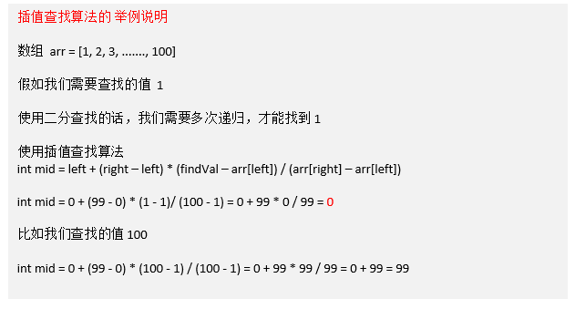

# 插值查找算法
---
## 基本介绍
1. 插值查找原理介绍:
插值查找算法类似于二分查找，不同的是插值查找每次从 **自适应**  `mid` 处开始查找。
2. $ mid = \frac{left + right}{2}=left+\frac{1}{2}(right-left)$
**改为**
$mid=left+\frac{findVal-array[left]}{array[rigth]-array[left]}(right-left)$
3. `int middleIndex = left + (right – left) * (findValue – array[left]) / (array[right] – array[left])`

---
## 举例说明


---
## 代码实现
```java
/**
 * 差值查找
 * @param arrary		数组
 * @param findValue		查找的值
 * @param left			查找数组的左索引
 * @param right			查找数组的右索引
 * @return				查找的值的索引
 */
public static int insertValueSearch(int[] arrary, int findValue, int left, int right) {
	System.out.println("insertValueSearch");
	if (left > right) {
		// 未找到
		return -1;
	}
	if (findValue > arrary[right]) {
		// 未找到
		return -1;
	}
	if (findValue < arrary[left]) {
		// 未找到
		return -1;
	}

	// 找到中间值
	int middleIndex =
			left + (findValue - arrary[left]) * (right - left) / (arrary[right] - arrary[left]);
	int middleValue = arrary[middleIndex];

	// 大于中间值,向右递归
	if (findValue > middleValue) {
		return insertValueSearch(arrary, findValue, middleIndex + 1, right);
	} else if (findValue < middleIndex) {
		// 小于中间值,向左递归
		return insertValueSearch(arrary, findValue, left, middleIndex - 1);
	} else {
		// 等于中间值,返回索引
		return middleIndex;
	}
}
```

---
## 注意事项
1. 对于数据量较大，关键字分布比较均匀的查找表来说，采用插值查找, 速度较快。
2. 关键字分布不均匀的情况下，该方法不一定比折半查找要好。
