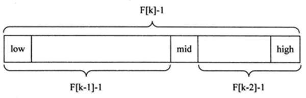
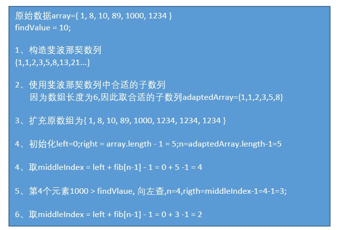

# 斐波那契（黄金分割）查找算法
---
## 基本介绍
斐波那契数列 `{1, 1, 2, 3, 5, 8, 13, 21, 34, 55 } ` 发现斐波那契数列的两个相邻数 的比例，无限接近 黄金分割值0.618

---
## 算法原理
斐波那契查找原理与（二分查找算法、插值查找算法）两种相似，仅仅改变了中间结点（mid）的位置， **`mid` 不再是中间或插值得到，而是位于黄金分割点附近** ，即 `mid=low+F(k-1)-1`（F 代表斐波那契数列），如下图所示:


对 F(k-1)-1 的理解：
1. 由斐波那契数列 `F[k]=F[k-1]+F[k-2]` 的性质，可以得到 `（F[k]-1）=（F[k-1]-1）+（F[k-2]-1）+1` 。该式说明： 只要顺序表( **待查找的数组** )的长度为 `F[k]-1`，则可以将该表分成长度为 `F[k-1]-1 `和 `F[k-2]-1` 的两段，即如上图所示。从而中间位置为 `mid=low+F(k-1)-1`
2. 类似的，每一子段也可以用相同的方式分割
3. 但顺序表长度 `n` 不一定刚好等于 `F[k]-1`，所以需要将原来的顺序表长度 `n` 增加至 `F[k]-1`。这里的 `k` 值只要能使得 `F[k]-1` 恰好大于或等于 `n` 即可，由以下代码得到,顺序表长度增加后，新增的位置（从 `n+1` 到 `F[k]-1` 位置）， 都赋为 `n` 位置的值即可。
    ```java
    while(n>fib(k)-1)
      k++;
    ```
---
## 图解


---
## 代码实现
```java
/**
 * 斐波那契查找算法
 * @param array			数组
 * @param findValue		查找的值
 * @return				查找的值的索引
 */
public static int fibSearch(int[] array, int findValue) {
	int low = 0;
	int high = array.length - 1;
	int n = 0;
	// 获得一个斐波那契数列(fib[n] >= array.length)
	int[] fibArray = getFibArray(20);
	while (fibArray[n] < array.length) {
		n++;
	}

	// 如果fib[n] > array.length,扩充数组
	int[] tempArray = Arrays.copyOf(array, fibArray[n]);
	if (fibArray[n] > array.length) {
		for (int i = array.length; i < tempArray.length; i++) {
			tempArray[i] = array[array.length - 1];
		}
	}

	while (low <= high) {
		// 获取mid值
		int middleIndex = low + fibArray[n - 1] - 1;
		int middleValue = tempArray[middleIndex];

		// 查找的值<mid值,斐波那契数列n--
		if (findValue < middleValue) {
			n -= 1;
			high = middleIndex - 1;
		} else if (findValue > middleValue) {
			// 查找的值>mid值,斐波那契数列n -= 2
			low = middleIndex + 1;
			n -= 2;
		} else {
			// 查找到当前值
			if (middleIndex <= array.length - 1) {
				return middleIndex;
			} else {
				return array.length - 1;
			}
		}

	}
	// 未找到
	return -1;
}

/**
 * 获取斐波那契数列
 * @param length	斐波那契数列长度
 * @return			斐波那契数列
 */
public static int[] getFibArray(int length) {
	int[] fibArray = new int[length];
	fibArray[0] = 1;
	if (length == 1) {
		return fibArray;
	}

	fibArray[1] = 1;
	if (length == 2) {
		return fibArray;
	}

	for (int i = 2; i < fibArray.length; i++) {
		fibArray[i] = fibArray[i - 1] + fibArray[i - 2];
	}
	return fibArray;
}
```
