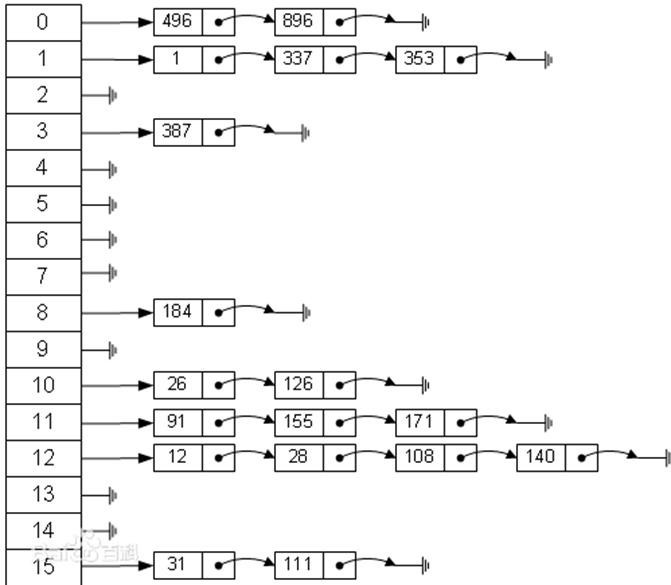

# 哈希表
---
## 需求
有一个公司,当有新的员工来报道时,要求将该员工的信息加入(id,性别,年龄,住址..),当输入该员工的id 时,要求查找到该员工的所有信息。

---
## 哈希表基本介绍
散列表（Hash table，也叫哈希表），是根据关键码值(Key value)而直接进行访问的数据结构。也就是说，它通过把关键码值映射到表中一个位置来访问记录，以加快查找的速度。这个映射函数叫做散列函数，存放记录的数组叫做散列表。

### 图解


---
## 代码实现
```java
public class HashTable {
	private int size;
	private EmpLinkedList[] empLinkedLists;

	public HashTable(int size) {
		this.size = size;
		empLinkedLists = new EmpLinkedList[size];
		// 初始化
		for (int i = 0; i < empLinkedLists.length; i++) {
			empLinkedLists[i] = new EmpLinkedList();
		}
	}

	public void add(Emp emp) {
		// 得到链表
		int hash = hash(emp.id);
		empLinkedLists[hash].add(emp);
	}

	public void list() {
		for (int i = 0; i < empLinkedLists.length; i++) {
			System.out.printf("第%d条链表信息：", (i + 1));
			empLinkedLists[i].list();
		}
	}

	private int hash(int id) {
		return id % size;
	}

	public void findById(int id) {
		int hash = hash(id);
		EmpLinkedList empLinkedList = empLinkedLists[hash];
		Emp emp = empLinkedList.findById(id);
		if (emp != null) {
			System.out.printf("在第%d 条链表中找到 雇员 id = %d\n", (hash + 1), id);
		} else {
			System.out.println("在哈希表中，没有找到该雇员~");
		}
	}

	public void removeById(int id) {
		int hash = hash(id);
		EmpLinkedList empLinkedList = empLinkedLists[hash];
		empLinkedList.remove(id);
	}
}

class Emp {
	public int id;
	public String name;
	public Emp next;

	public Emp(int id, String name) {
		super();
		this.id = id;
		this.name = name;
	}

	@Override
	public String toString() {
		return "Emp [id=" + id + ", name=" + name + "]";
	}
}

class EmpLinkedList {
	private Emp head;

	public void add(Emp emp) {
		// 链表为空
		if (head == null) {
			head = emp;
			return;
		}

		// 找到最后一个雇员
		Emp lastEmp = head;
		while (lastEmp.next != null) {
			lastEmp = lastEmp.next;
		}

		// 插入新的雇员
		lastEmp.next = emp;
	}

	public void remove(int id) {
		// 找到对应的雇员
		if (head == null) {
			throw new RuntimeException("链表为空,不能删除");
		}
		if (head.id == id) {
			head = head.next;
			return;
		}

		// 找到要删除雇员的前一个雇员
		Emp findEmpPrev = null;
		Emp tempEmp = head;
		while (tempEmp.next != null) {
			if (tempEmp.next.id == id) {
				findEmpPrev = tempEmp;
				break;
			}
			tempEmp = tempEmp.next;
		}

		if (findEmpPrev == null) {
			throw new RuntimeException("要删除的雇员不存在,不能删除");
		}

		// 删除
		findEmpPrev.next = findEmpPrev.next.next;
	}

	public Emp findById(int id) {
		Emp findEmp = null;
		Emp tempEmp = head;
		while (tempEmp != null) {
			if (tempEmp.id == id) {
				findEmp = tempEmp;
				break;
			}

			tempEmp = tempEmp.next;
		}

		return findEmp;
	}

	public void list() {
		if (head == null) {
			System.out.println("链表为空");
			return;
		}

		Emp tempEmp = head;
		while (tempEmp != null) {
			System.out.printf(tempEmp.toString() + "\t");
			tempEmp = tempEmp.next;
		}
		System.out.println();
	}
}
```
