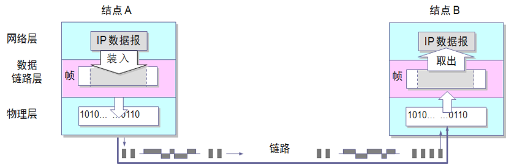
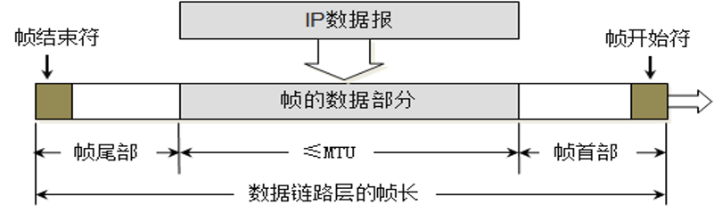
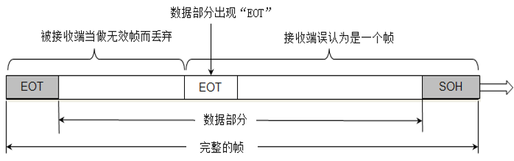
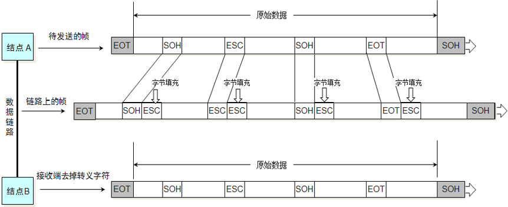
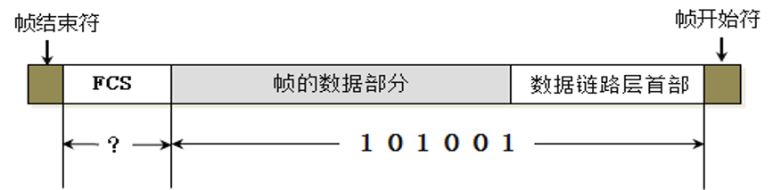
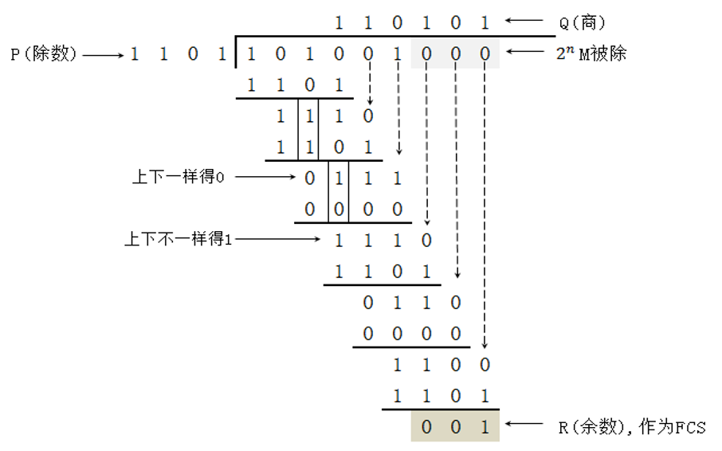
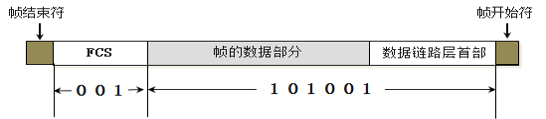

# 数据链路层的三个基本问题
## 基本概念
* 链路
**链路（Link）** 是指的从一个节点到相邻节点的一段物理线路（有线或无线），而中间没有任何其他的交换节点。
* 数据链路
**数据链路（Data Link）** 则是另一个概念，这是因为当需要在一条线路上传送数据时，除了必须有一条物理线路外，还必须有一些必要的 **通信协议** 来控制这些数据的传输。
* 数据链路和帧
数据链路层把网络层交下来的数据 **封装成帧** 发送到链路上，以及把接收到的帧中的数据取出并上交给网络层。在因特网中，网络层协议数据单元就是IP数据报（或简称为数据报、分组或包）。数据链路层封装的帧，在物理层变成数字信号在链路上传输。

---
## 封装成帧
封装成帧，就是在将网络层的IP数据报的前后分别 **添加首部和尾部**，这样就构成了一个帧。

不同的数据链路层协议的帧的首部和尾部包含的信息有明确的规定，帧的首部和尾部有帧开始符和帧结束符，称为帧定界符。接收端收到物理层传过来的数字信号读取到帧开始字符一直到帧结束字符，就认为接收到了一个完整的帧。
在数据传输中出现差错时，帧定界符的作用更加明显。

每一种数据链路层协议都规定了所能够传送的帧的数据部分长度的上限--**即最大传输单元MTU（Maximum Transfer Unit），以太网的MTU为1500个字节。**

---
## 透明传输
**帧开始符和帧结束符最好是不会出现在帧的数据部分的字符** ，通常我们电脑键盘能够输入的字符是ASCII字符代码表中打印字符，在ASCII字符代码表中，还有非打印控制字符，在非打印字符中有两个字符专门用来做帧定界符，代码SOH（Start Of Header）作为帧开始定界符，对应的二进制编码为0000 0001，代码EOT（End Of Transmission）作为帧结束定界符。

当数据部分是非ASCII字符代码表的文本文件时（比如二进制代码的计算机程序或图像等），情况就不同了。如果数据中的某一段二进制代码正好和SOH或EOT帧定界符编码一样，接收端就会 **误认为这就是帧的边界**。

---
## 差错检验
现实的通信链路都不会是理想的。这就是说， **比特在传输过程中可能会产生差错：1可能会变成0，而0也可能变成1** ，这就叫做比特差错。

为了保证数据传输的可靠性，在计算机网络传输数据时， **必须采用各种差错检测措施** 。目前在数据链路层广泛使用了循环冗余检验CRC(Cyclic Redundancy Check）的差错检验技术。

FCS(Frame Check Sequence)

### CRC

除数是发送端和接收端协商的， **越大则出错的可能性越小**

接收端接收到帧后， **用(数据部分+FCS)/除数**， 如果余数为0，则证明数据无错，否则，直接 **丢弃数据**。
