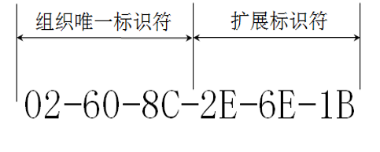

# MAC地址
在广播信道 **实现点到点通信** ，这就需要网络中的 **每个网卡有一个地址** 。这个地址称为物理地址或MAC地址（因为这种地址用在MAC帧中）。IEEE802标准为局域网规定了一种48位的全球地址。

这种6字节的MAC地址已被固化在网卡的ROM中。因此，MAC地址也叫作硬件地址（hardware address）或物理地址。当这块网卡插入（或嵌入）到某台计算机后，网卡上的MAC地址就成为这台计算机的MAC地址了。

网卡有过滤功能，适配器从网络上每收到一个MAC帧就先用硬件检查MAC帧中的目的地址 **。如果是发往本站的帧则收下，然后再进行其他的处理。否则就将此帧丢弃，不再进行其他的处理** 。这样做就不浪费主机的处理机和内存资源。这里“发往本站的帧”包括以下三种帧：
1. 单播（unicast）帧（一对一），即 **收到的帧的MAC地址与本站的硬件地址相同** 。
2. 广播（broadcast）帧（一对全体），即 **发送给本局域网上所有站点的帧（全1地址）** 。
3. 多播（multicast）帧（一对多），即 **发送给本局域网上一部分站点的帧** 。
