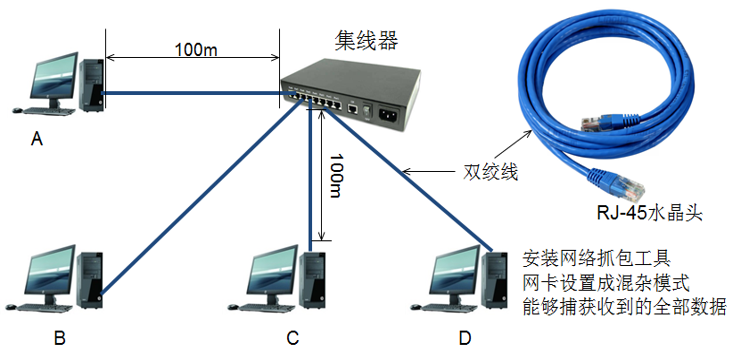
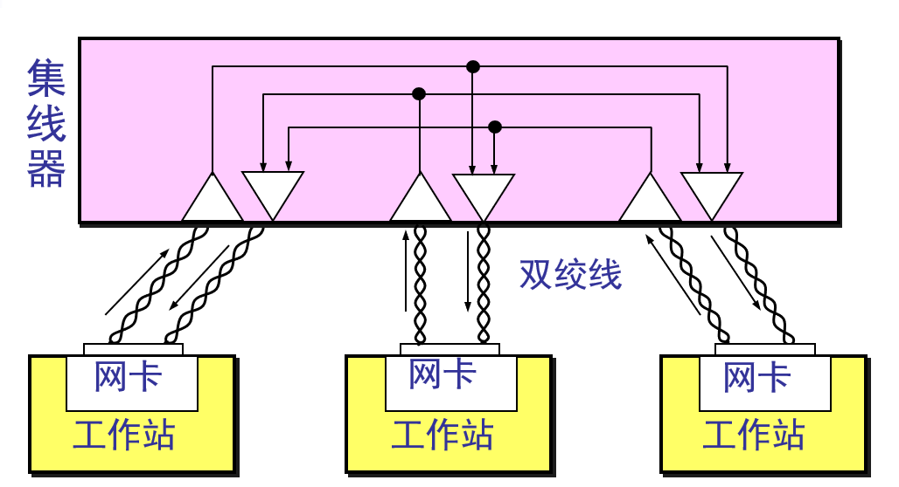
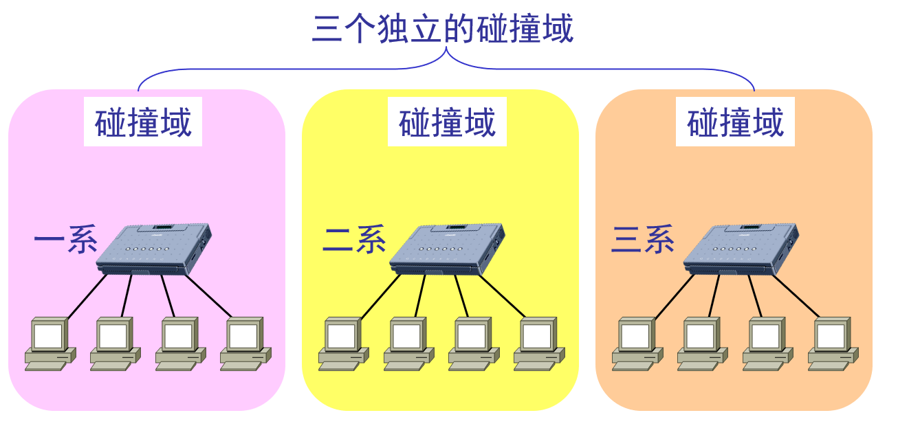
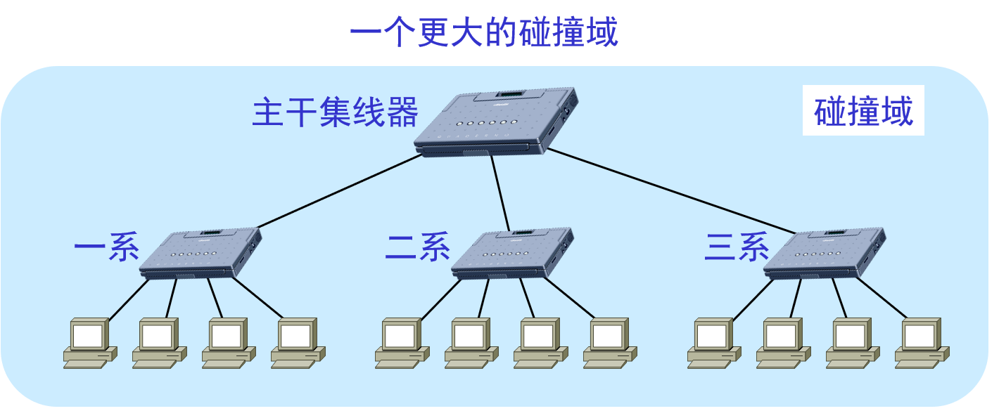
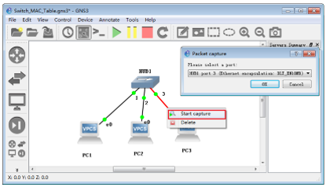
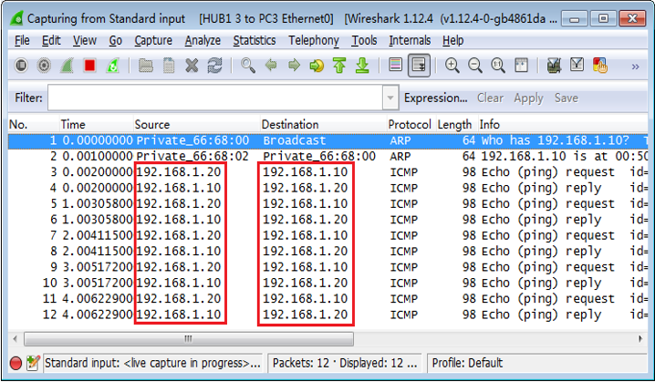

# 集线器
传统以太网最初是使用 **粗同轴电缆** ，后来演进到使用比较便宜的 **细同轴电缆** ，最后发展为使用更便宜和更灵活的 **双绞线** 。

1990年IEEE制定出星形以太网10BASE-T的标准802.3i。“10”代表10Mb/s的数据率，BASE表示连接线上的信号是基带信号，T代表双绞线。

10BASE-T以太网的通信距离稍短，每个站到集线器的距离不超过100m。

**集线器和网线一样工作在物理层。**

**将数据发送到所有局域网内的机器上**

# 使用集线器扩展以太网
某大学有三个系，各自有一个局域网

**用集线器组成更大的局域网都在一个碰撞域中**

### 优点
* 使原来属于不同碰撞域的局域网上的计算机能够进行跨碰撞域的通信。
* 扩大了局域网覆盖的地理范围。

### 缺点
* 碰撞域增大了，但总的吞吐量并未提高。
* 如果不同的碰撞域使用不同的数据率，那么就不能用集线器将它们互连起来。   

# 集线器不安全

