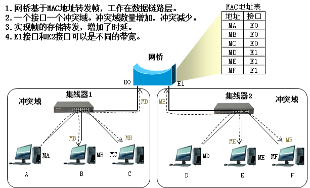
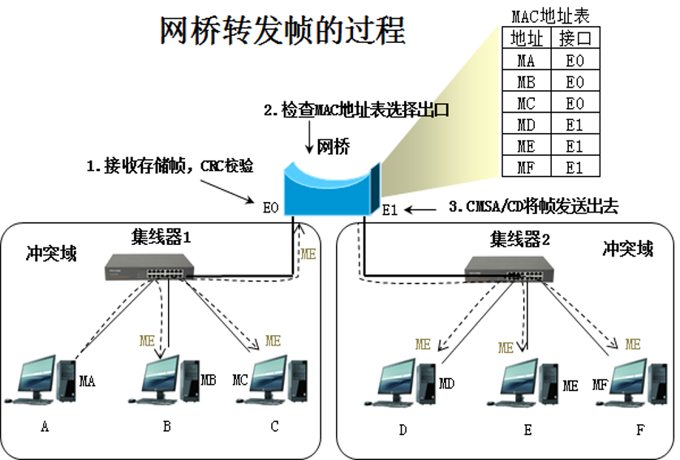
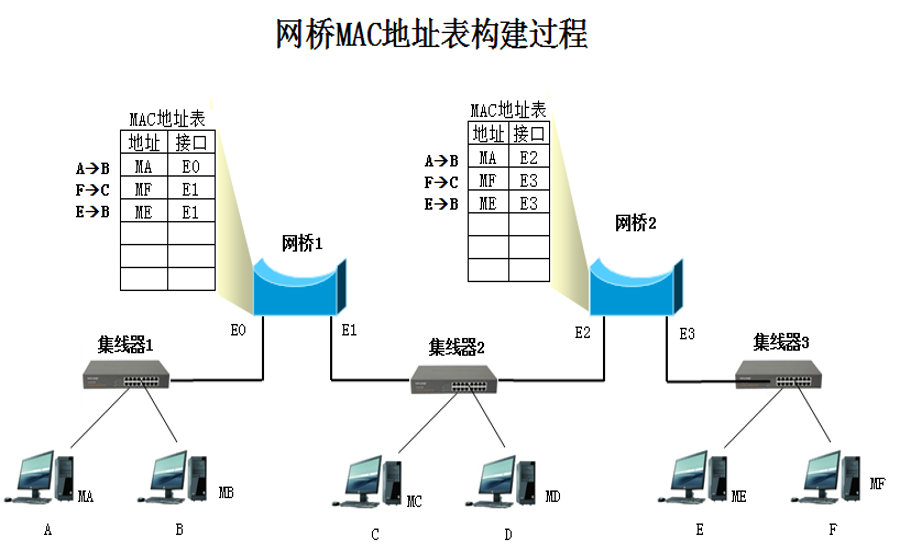

# 网桥
网桥基于MAC地址转发

隔绝冲突

# 网桥转发帧的过程

---
# 网桥自动构建MAC地址表
使用网桥优化以太网，对于网络中的计算机是没有感觉的，也就是以太网中的计算机是不知道网络中有网桥存在，也不需要网络管理员配置网桥的MAC地址表，因此我们称网桥是透明桥接。

网桥接入以太网时，MAC地址表示空的， **网桥会在计算机通信过程中自动构建MAC地址表，这称为“自学习”** 。
1. 自学习
网桥的接口收到一个帧，就要检查MAC地址表中与收到的帧源MAC地址有无匹配的项目，**如果没有，就在MAC地表中添加** 该接口和该帧的源MAC地址对应关系以及进入接口的时间， **如果有，则把原有的项目进行更新** 。
2. 转发帧
网桥接口收到一个帧，就检查MAC地址表中有没有该帧目标MAC地址对应端口， **如果有，就会将该帧转发到对应的端口，如果没有，则将该帧转发到全部端口（接收端口除外）** 。

