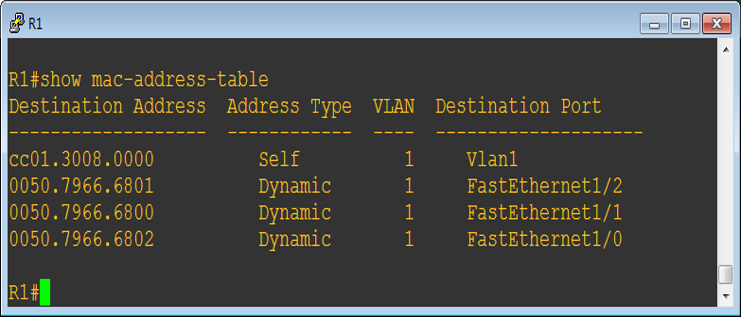

# 交换机
随着技术的发展，网桥接口增多， **网桥的接口就直接连接计算机了** ，网桥就发展成现在的交换机。

---
# 交换机特点
* **独享带宽**
交换机的每个端口独享带宽，10M交换机，则每个端口带宽是10M，24口10M交换机，交换机的总体交换能力是240M，这和集线器不同。
* **安全**
使用交换机组建的网络比集线器安全，比如计算机A给计算机B发送的帧，以及计算机D给计算机C发送的帧，交换机根据MAC地址表只转发到目标端口，E计算机根本收不到其他计算机的通信的数字信号，即便安装了抓包工具也没用。
* **全双工通信**
交换机接口和计算机直接相连，计算机和交换机之间的链路可以使用全双工通信。
* **全双工不再使用CSMA/CD协议**
交换机接口和计算机直接相连接，使用全双工通信数据链路层就不需要使用CSMA/CD协议，但我们还是称交换机组建的网络是以太网，是因为帧格式和以太网一样。
* **接口可以工作在不同的速率**

---
# 广播帧

---
# 集线器&交换机&路由器的比较
集线器是冲突域
交换机是广播域
路由器隔绝广播

---
# 交换机MAC地址表

---
# 交换机端口安全

