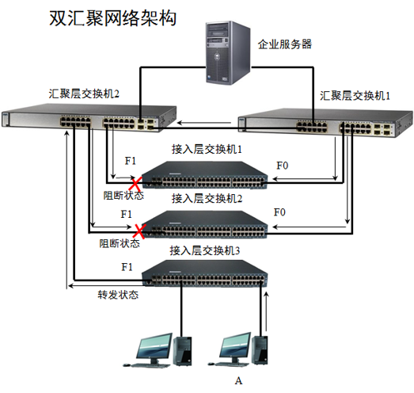

# 生成树协议
## 为什么需要生成树协议
---
### 单点故障

---
### 双汇聚层(解决单点故障)
有环路
形成广播风暴

* 广播风暴

---
## 生成树协议
为了解决 **单点故障**，引入 **双汇聚层**,但有带来了 **环路**，导致了 **广播风暴**，为了解决 **环路** 问题，引入 **生成树协议阻断环路**

### 特点
* 链路有 **变化** 会重新运行生成树算法
* 将原来的阻断端口更为转发端口

