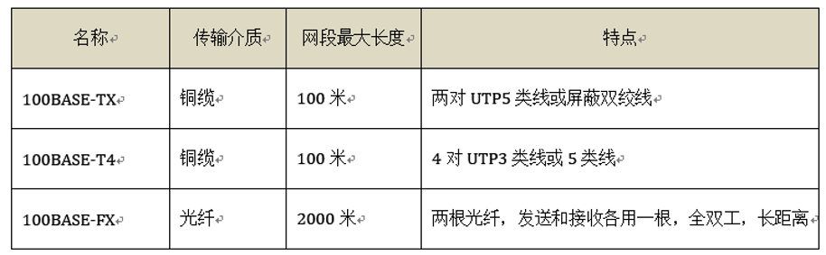
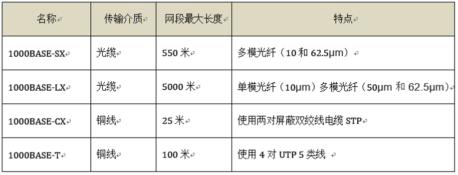
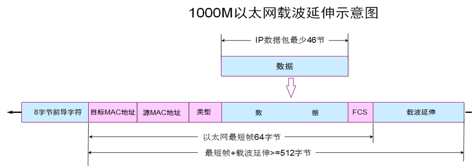
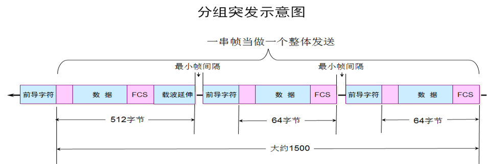
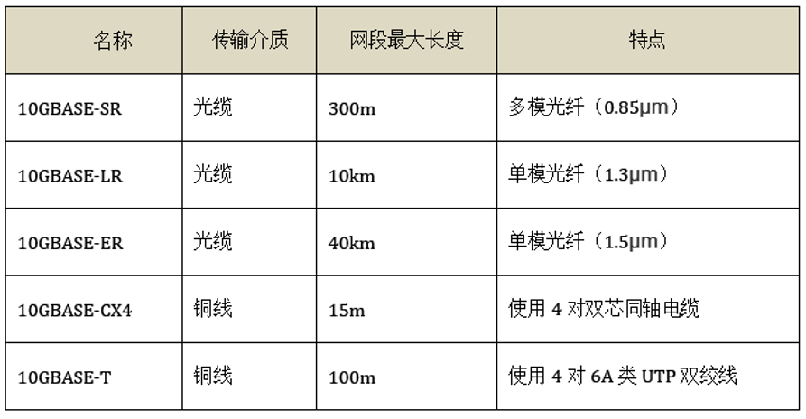

# 高速以太网
## 100M以太网
100BASE-T是在双绞线上传送100Mb/s基带信号的星型拓扑的以太网，仍使用IEEE802.3的CSMA/CD协议，它又称为快速以太网（FastEthernet）。

使用交换机组建的100BASE-T以太网，可在全双工方式下工作而无冲突发生。因此，CSMA/CD协议对全双工方式工作的快速以太网是不起作用的。因为其帧格式和以太网一样，所以依然 **称交换机组件的网络为以太网** 。

以太网的最短帧和带宽和链路长度有关，100M以太网比10M以太网速率提高10倍， **要想和10M以太网兼容，就要确保最短帧也是64字节** ，那就将 **电缆最大长度由1000m降到100m** ，因此以太网的争用期依然是5.12μs，最短帧依然是64字节。

---
## 吉比特以太网
吉比特以太网的标准IEEE802.3 z有以下几个特点：
* 允许在1Gb/s下全双工和半双工两种方式工作。
* 使用IEEE802.3协议规定的帧格式。
* 在半双工方式下使用CSMA/CD协议（全双工方式不需要使用CSMA/CD协议）。
* 与10BASE-T和100BASE-T技术向后兼容。

### 载波延伸
吉比特以太网工作在半双工时，就必须进行碰撞检测，数据速率提高了，要想和10M以太网兼容，就要确保最短帧也是64字节，这只能减少最大电缆长度，以太网最大电缆长度就要缩短到10m，短到几乎没有什么实用价值。 **吉比特以太网为了增加最大传输距离，将最短帧增加到4096比特** 。

当数据帧长度小于512字节（即4096比特）时， **在FCS域后面添加“载波延伸” 域** 。主机发送完短数据帧之后，继续发送载波延伸信号，冲突信号传回来时，发送端就能感知到了。

### 分组突发
如果发送的数据帧都是64字节的短报文，那么 **链路的利用率就很低**，因为“载波延伸”域将占用大量的带宽。

千兆以太网标准中，引入了 **“分组突发”（packet bursting）机制** 来改善这个问题。这就是当很多短帧要发送时，第一个短帧采用上面所说的载波延伸的方法进行填充，随后的一些短帧则可以一个接一个发送，它们之间只需要留有必要的帧间最小间隔即可。

## 10吉比特以太网
10GE的帧格式与10Mb/s，100Mb/s和1Gb/S以太网的 **帧格式完全相同** 。10GE还保留了802.3标准规定的以太网最小和最大帧长。

由于数据率很高，10GE不再使用铜线而只使用光纤作为传输媒体。它使用长距离（40km）的光收发器与单模光纤接口，以便能够工作在广域网和城域网的范围。

10GE只工作在全双工模式，因此 **不存在争用问题，也不使用CSMA/CD协议** 。这就使得10GE的传输距离不再受碰撞检测的限制而大大提高了。

* 10GE的物理层标准

