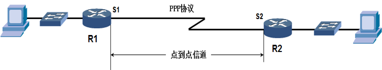
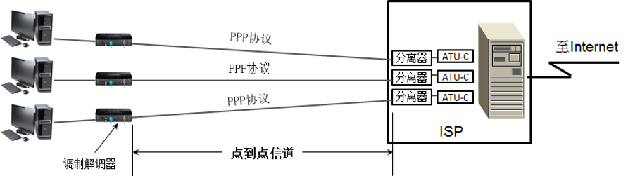
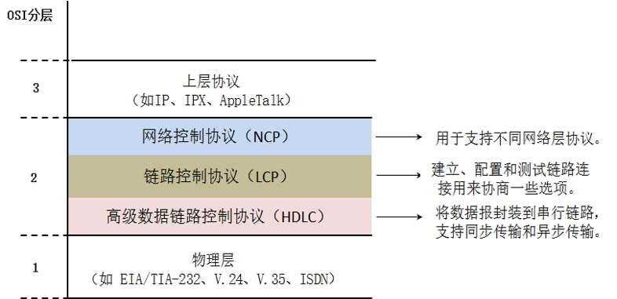
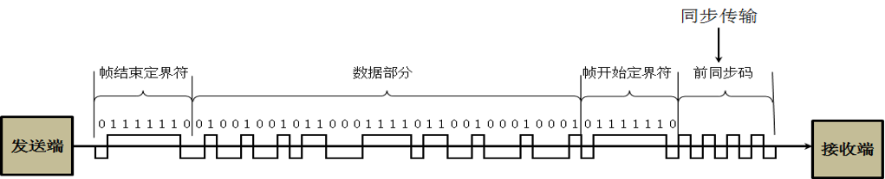
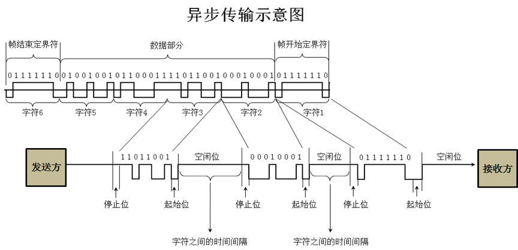
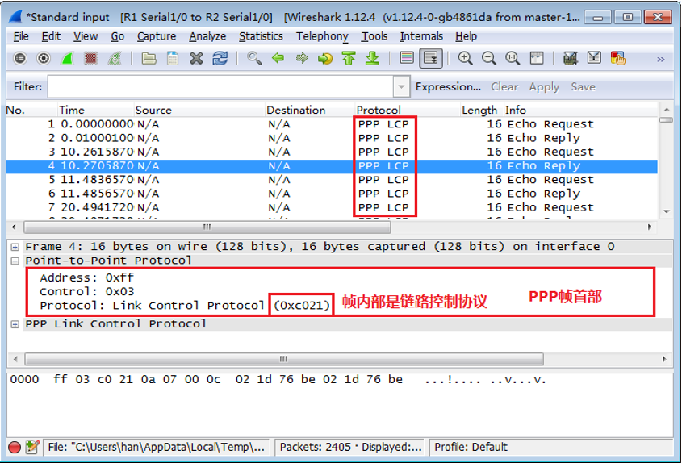
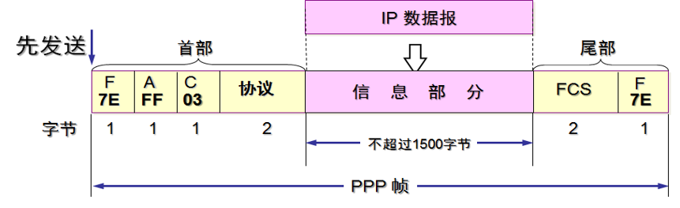
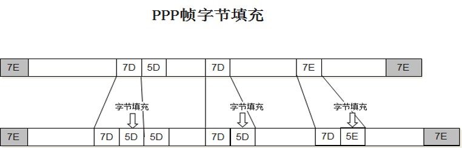
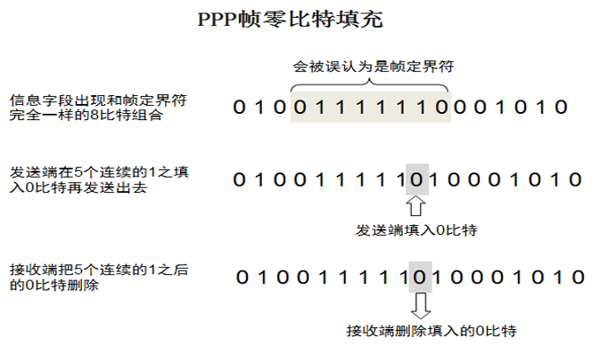

# 点到点信道的数据链路
点到点信道是指的一条链路上就一个发送端和接收端的信道，通常用在广域网链路。

# PPP协议的特点
1. 简单
  不提供可靠传输
2. 封装成帧
  首部和尾部    帧开始符 帧结束符
3. 透明传输
  加转义字符 收到后去掉转移字符
4. 差错检测
  CRC计算FCS
5. 支持多种网络层协议
  IPv4和IPv6网络层协议都可以封装到PPP帧中
6. 多种类型链路
  光纤 铜线 同步传输  异步传输 串行、并行链路均可
7. 检测连接状态
  检测连接状态
8. 最大传送单元
  最大传输单元  1500字节
9. 网络层地址协商
  能够为拨号的一段分配IP地址，子网掩码 网关和DNS
10. 数据压缩协商

# PPP协议有三个组成部分

# 同步传输
**同步传输（Synchronous Transmission）** 以 **数据帧** 为单位传输数据，可采用 **字符形式或位组合形式的帧同步信号**，在短距离的高速传输中，该时钟信号可由专门的时钟线路传输，由发送端或接收端提供专用于同步的时钟信号。计算机网络采用同步传输方式时，常将时钟同步信号（前同步码）植入数据信号帧中，以实现接收端与发送端的时钟同步。

# 异步传输
**异步传输（Asynchronous Transmission）** 以 **字符** 为单位传输数据，发送端和接收端具有相互独立的时钟（频率相差不能太多），并且两者中任一方都不向对方提供时钟同步信号。

# PPP的帧首部

* `Address`字段的值为0xff，0x表示后面的ff为十六进制数，写成二进制为1111 1111，占一个字节的长度。点到点信道PPP帧中的地址字段形同虚设，可以看到没有源地址和目标地址。
* `Control`字段的值为0x03，写成二进制为0000 0011，占一个字节长度。最初曾考虑以后对地址字段和控制字段的值进行其他定义，但至今也没给出。

# 异步传输使用字节填充
在异步传输的链路上，数据传输以字节为单位，PPP帧的转义符定义为0x7D，并使用字节填充。

把信息字段中出现的每一个0x7E字节转变成为2字节序列（0x7D，0x5E）。

若信息字段中出现一个0x7D的字节（即出现了和转义字符一样的比特组合），则把0x7D转变成为2字节序列（0x7D，0x5D）。

# 同步传输使用零比特填充
在同步传输的链路上，数据传输以帧为单位，PPP协议采用零比特填充方法来实现透明传输。大家把PPP协议帧界定符0x7E写成二进制01111110,也就是可以看到中间有连续的6个1,只要想办法在数据部分不要出现连续的6个1,就肯定不会出现这界定符。具体办法就是“零比特填充法”。

---
# PPP协议工作状态
当用户拨号接入 ISP 时，路由器的调制解调器对拨号做出确认，并 **建立一条物理连接** 。

PC 机向路由器 **发送一系列的 LCP 分组** （封装成多个 PPP 帧）。

这些分组及其响应选择一些 PPP 参数，和进行网络层配置， **NCP 给新接入的 PC机分配一个临时的 IP 地址** ，使 PC 机成为因特网上的一个主机。

通信完毕时， **NCP 释放网络层连接，收回原来分配出去的 IP 地址** 。

接着，LCP **释放数据链路层连接。最后释放的是物理层的连接** 。    
