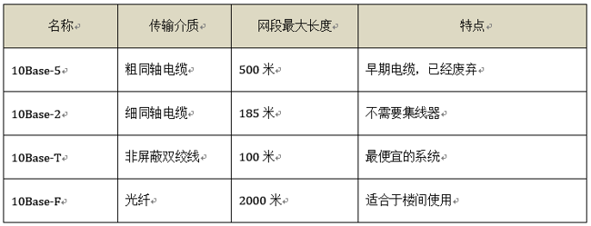

# 以太网标准
**以太网（Ethernet）** 是一种计算机局域网组网技术。IEEE制定的IEEE 802.3标准给出了以太网的技术标准，即以太网的 **介质访问控制协议**（CSMA/CD）及物理层技术规范（包括物理层的连线、电信号和介质访问层协议的内容）。

在IEEE 802.3标准中，为不同的传输介质制定了不同的物理层标准，在这些标准中前面的数字表示传输速度，单位是“Mbps”，最后的一个数字表示单段网线长度（基准单位是100m），Base表示“基带”的意思。

