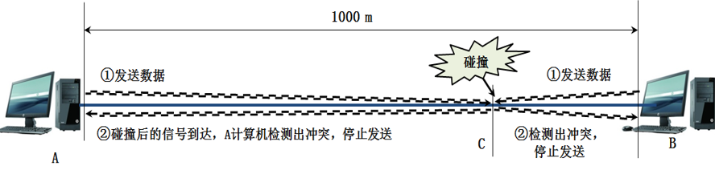

# CSMA/CD
（`Carrier Sense Multiple Access with Collision Detection`，载波侦听多路访问/冲突检测协议）

**总线型网络** 使用CSMA/CD协议进行通信，即带冲突检测的载波侦听多点接入技术。

即便检测出总线上没有信号， **开始发送数据后** 也有可能和迎面而来的信号在 **链路上发生碰撞**。

比如，A计算机发送的信号和B计算机发送的信号在链路C处发生碰撞，碰撞后的信号相互叠加，在总线上电压变化幅度将会增加，发送方检测到电压变化超过一定的门限值时，就认为发生冲突，这就是 **冲突检测** 。

