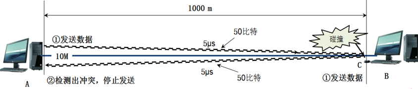
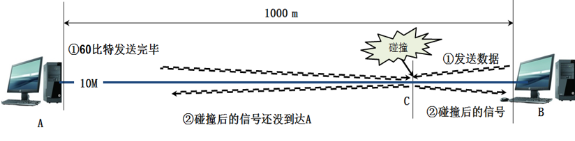

# 以太网最短帧
为了能够检测到正在发送的帧在总线上是否产生冲突，以太网的帧不能太短，如果太短就有可能检测不到自己发送的帧产生了冲突。

不能检测到自己发的帧是否发生了冲突

以太网设计最大端到端长度为5km（实际上的以太网覆盖范围远远没有这么大），单程传播时延为大约为25.6μs, **往返传播时延为51.2μs** ，10M标准以太网最小帧为：

`10Mb/s×51.2μs =107b/s×51.2×10-6s=512b`

512比特也就是64字节，这就意味着以太网发送数据帧如果前64字节没有检测出冲突，后面发送的数据就一定不会发生冲突。换句话说，如果发生碰撞，就一定在发送前64字节之内。由于一旦检测出冲突就立即终止发送，这时发送的数据一定小于64字节，因此凡是长度小于64字节的帧都是由于冲突而异常终止的无效帧，只要收到了这种无效帧，就应当立即将其终止。
