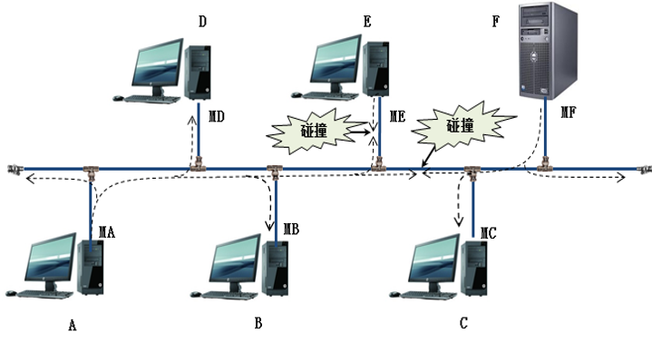

# 退避解决算法--退避算法
总线型网络中的计算机数量越多，在链路上发送数据产生冲突机会就多。

计算机要想知道发送的帧在链路上是否发生碰撞必须 **等待2τ，2τ称为争用期**。

以太网使用截断 **二进制指数退避（truncated binary exponential backoff）算法** 来解决碰撞问题。
1. 确定基本退避时间，它就是争用期2τ。以太网把争用期定为51.2μs。对于10Mb/s以太网，在争用期内可发送512bit，即64字节。也可以说争用期是512比特时间。1比特时间就是发送1比特所需的时间。所以这种时间单位与数据率密切相关。
2. 从离散的整数集合［0，1，…，（2k-1）］中随机取出一个数，记为r。重传应推后的时间就是r倍的争用期。上面的参数k按下面的公式计算：
`k=Min[重传次数，10]`
可见当重传次数不超过10时，参数k等于重传次数；但当重传次数超过10时， **k就不再增大而一直等于10** 。
3. 当重传达 **16** 次仍不能成功时（这表明同时打算发送数据的站太多，以致连续发生冲突），则丢弃该帧，并向高层报告。
