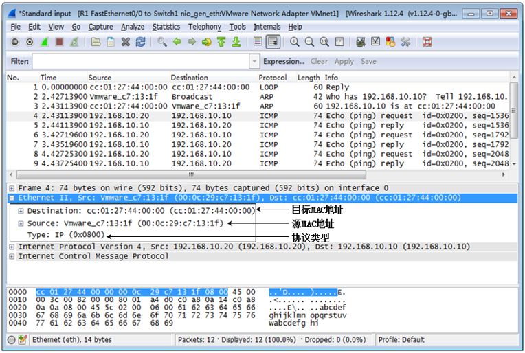
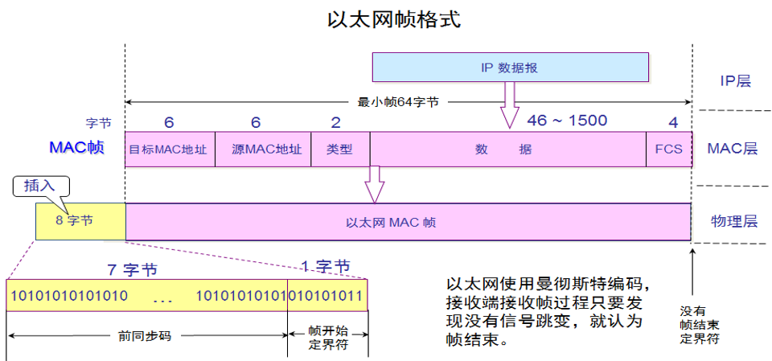
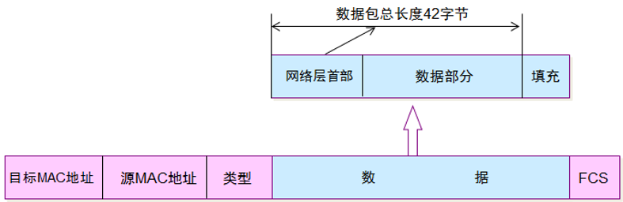

# 以太网帧格式
常用的以太网MAC帧格式有两种标准，一种是EthernetV2标准（即以太网V2标准），另一种是IEEE的802.3标准。使用得最多的是 **以太网V2的MAC帧格式** 。

---
## MAC帧格式
Ethernet II的帧比较简单，由五个字段组成。

---
## 最短帧长度
当数据字段的长度小于46字节时，数据链路层就会在数据字段的后面加入一个整数字节的填充字段， **以保证以太网的MAC帧长不小于64字节**  ，接收端还必须能够将添加的字节去掉。

---
## 无效Mac帧
IEEE802.3标准规定凡出现下列情况之一的即为无效的MAC帧：
1. 帧的 **长度不是整数个字节** 。
2. 用收到的帧检验序列 **FCS查出有差错** 。
3. 收到的帧的MAC客户数据字段的 **长度不在46-1500字节之间** 。考虑到MAC帧首部和尾部的长度共有18字节，可以得出有效的MAC帧长度为64-1518字节之间。对于检查出的无效MAC帧就简单地丢弃。以太网 **不负责重传丢弃的帧** 。
