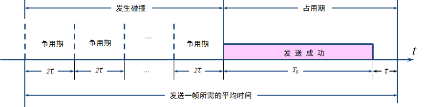
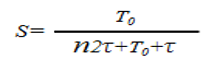
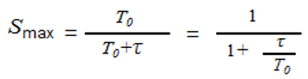
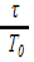

# 以太网信道利用率
利用率是指的 **发送数据的时间** 占 **整个时间** 的比例。如图所示，平均发送一帧所需要的时间，经历了n倍争用期2τ，T0为发送该帧所需时间，τ为该帧传播时延。

有冲突时信道利用率为

---
## 如何提高信道利用率
从公式可以看出，要想提高信道利用率最好是n为0，这就 **意味着以太网上的各个计算机发送数据不会产生碰撞** （这显然已经不是CSMA/CD，而需要一种特殊的调度方法），并且能够非常有效的利用网络的传输资源，即总线一旦空闲就有一个站立即发送数据。这种情况算出来的信道利用率是极限信道利用率。

要想提高极限信道利用率就要降低公式中

τ值和以太网连线的长度有关，这就意味着τ值要小， 以太网 **网线的长度就不能太长** 。带宽一定的情况下T0和帧的长度有关，这就意味着， **以太网的帧不能太短** 。

**总结**
提高信道利用率有以下两个方法：
1. 网线尽量不要太长
2. 发送的帧不要太短
