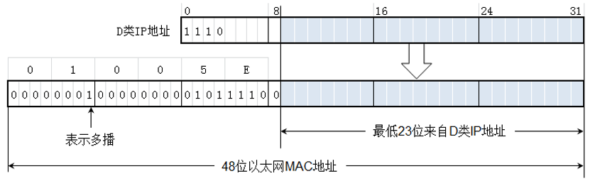

# 基本原理
Internet 组管理协议称为IGMP协议（Internet Group Management Protocol），是因特网协议家族中的一个组播协议。该协议运行在主机和组播路由器之间，IGMP协议是网络层协议。要想搞明白IGMP协议的作用和用途，先要搞明白什么是组播通信，组播也称为多播。

组播建立的基本流程：
1. **加入组播**(客户端发送请求加入到组播中);
2. 服务器将数据发送至 **组播地址** (源地址为流媒体服务器地址，目标地址为组播地址)
3. 数据进行拷贝转发，直到转发到加入组播的客户机上

---

# 组播IP地址
IP地址中的D类地址是组播地址。D类IP地址的前四位是1110，因此D类地址范围是224.0.0.0到239.255.255.255。我们就用每一个D类地址标志一个多播组。

多播地址只能用于目的地址，而 **不能用于源地址**。

D类地址中有一些是不能随意使用的，因为有的地址己经被IANA指派为永久组地址了[RFC3330]。例如：
* 224.0.0.0基地址（保留）
* 224.0.0.1在本子网上的所有参加多播的主机和路由器
* 224.0.0.2在本子网上的所有参加组播的路由器
* 224.0.0.3未指派
* 224.0.0.4 DVMRP路由器
* …….
* 224.0.1.0至238.255.255.255全球范围都可使用的组播地址
* 239.0.0.0至239.255.255.255限制在一个组织的范围

---

# 组播MAC地址
目标地址是组播IP地址的数据包到达以太网，就要使用组播MAC地址封装，组播MAC地址使用组播IP地址构造。

为了支持IP 组播，因特网号码指派管理局IANA已经为 Ethernet的MAC地址保留了一个组播地址区间：01-00-5E-00-00-00 到 01-00-5E-7F-FF-FF。如下图所示，组播MAC地址48位的MAC地址中的高25位是固定的，为了映射一个IP 多播地址到MAC层的组播地址，IP多播地址的低23位可以直接映射为MAC层组播地址的低23位。

## 举例
比如组播IP地址224.128.64.32，如下图所示，使用上面的方法构造出的MAC地址为01-00-5E-00-40-20。

# IGMP举例
主机通过IGMP通知路由器希望接收或离开某个特定组播组的信息。

路由器通过IGMP周期性地查询局域网内的组播组成员是否处于活动状态，实现所连网段组成员关系的收集与维护。

