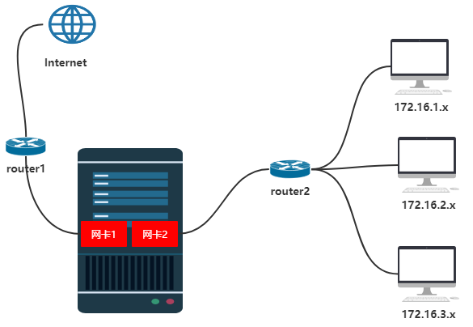

## IP数据报的转发流程
数据路由：路由器在不同的网络转发数据包的过程

### 路由表
#### 为什么需要路由表?

网络通畅的条件：**能去能回**
  * 沿途的路由器必须知道目标网络的下一跳给哪个接口
  * 沿途的路由器必须知道源网络下一跳给哪个接口

### windows的网关实际上是默认路由

如上图，一台服务器有两个网卡 **网卡1** 和 **网卡2**，一个连接互联网，一个连接内网，现在 **两个网卡都配置了网关** ，有如下问题：**从Internet来ping服务器，会产生50%的丢包。**，为什么会产生如上问题呢？
答：**因为网卡1和网卡2都配置了网关，因此对于服务器来说，其路由表中就有两条路径可以走，按照负载均衡的原则，第一次走router1这条线路，第二次就走router2这条线路**。

如何解决上述问题?
答：**给网卡2不配置网关，在路由表中添加到172.16.x时统一走router2这条线路。**，然后当用户访问外网时就只会走router1这条线路，当用户访问内网时，查找路由表，就会走router2这条线路，就解决了上述问题。

### 负载均衡
