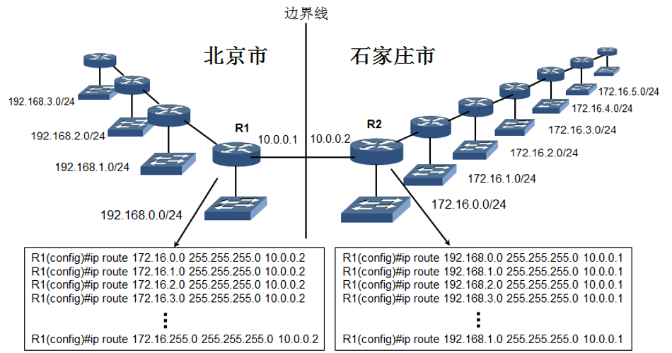
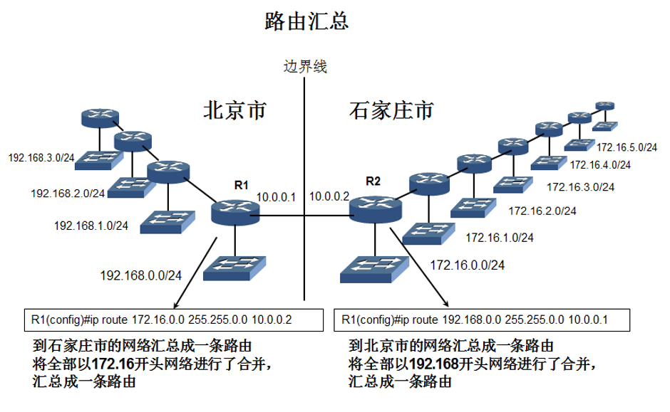
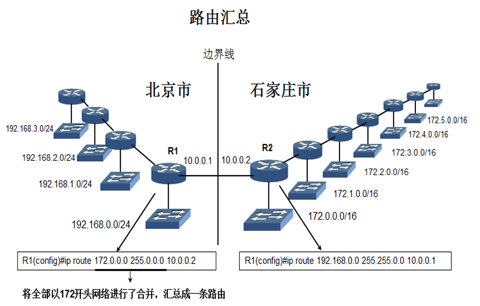
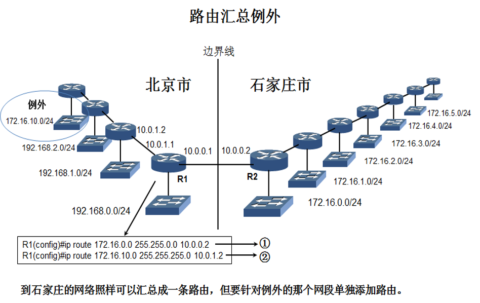
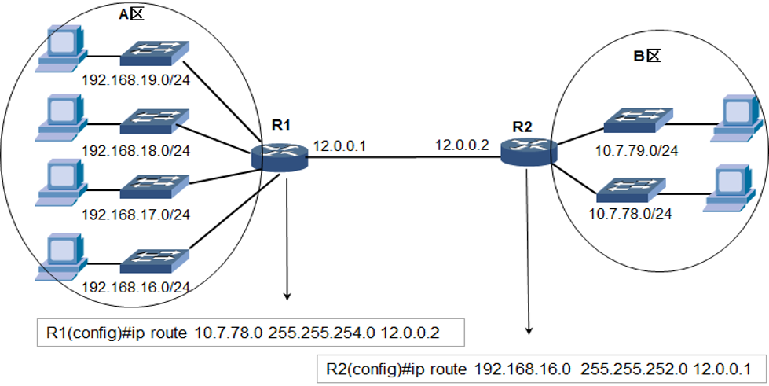

# 路由汇总
Internet是全球最大的互联网，如果Internet上的路由器把全球所有的网段都添加到路由表，那将是一个非常庞大的路由表。路由器每转发一个数据包，都要检查路由表为该数据包选择转发接口，庞大的路由表势必会增加处理时延。

通过合理的地址规划，可以通过路由汇总简化路由表。

**将物理位置连续的网络分配地址连续的网段，就可以在边界路由器上将远程的网络合并成一条路由，这就是路由汇总。**

---

# 不汇总的路由表

---

# 汇总的路由表

---

# 举例
## 实例1

## 实例2(路由汇总例外)

# 无类域间路由（CIDR）
无类域间路由（CIDR）采用13～27位可变网络ID，而不是A、B、C类网络ID所用的固定的8、16和24位。

这样我们可以将子网掩码向左移动1位，合并两个网段；向左移动2位合并4个网段；向左移动3位合并8个网段；向左移动n位，就可以合并2n个网段。

