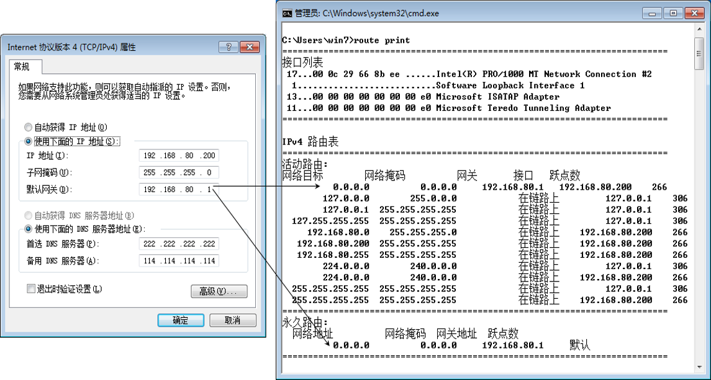

# windows的网关实际上是默认路由

# 路由表项
* destination：
  目的地址，用来标识IP包的目的地址或者目的网络。
* mask：
  网络掩码，与目的地址一起标识目的主机或者路由器所在的网段的地址。
* pre：
  标识路由加入IP路由表的优先级。可能到达一个目的地有多条路由，但是优先级的存在让他们先选择优先级高的路由进行利用。
* cost：
  路由开销，当到达一个目的地的多个路由优先级相同时，路由开销最小的将成为最优路由。
* interface：
  输出接口，说明IP包将从该路由器哪个接口转发。
* nexthop：
  下一跳IP地址，说明IP包所经过的下一个路由器。

## 网络排错例子

如上图，一台服务器有两个网卡 **网卡1** 和 **网卡2**，一个连接互联网，一个连接内网，现在 **两个网卡都配置了网关** ，有如下问题：**从Internet来ping服务器，会产生50%的丢包。**，为什么会产生如上问题呢？
答：**因为网卡1和网卡2都配置了网关，因此对于服务器来说，其路由表中就有两条路径可以走，按照负载均衡的原则，第一次走router1这条线路，第二次就走router2这条线路**。

如何解决上述问题?
答：**给网卡2不配置网关，在路由表中添加到172.16.x时统一走router2这条线路。**，然后当用户访问外网时就只会走router1这条线路，当用户访问内网时，查找路由表，就会走router2这条线路，就解决了上述问题。
