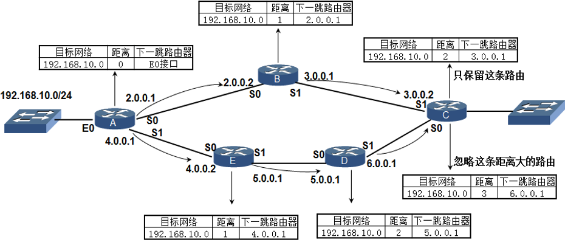
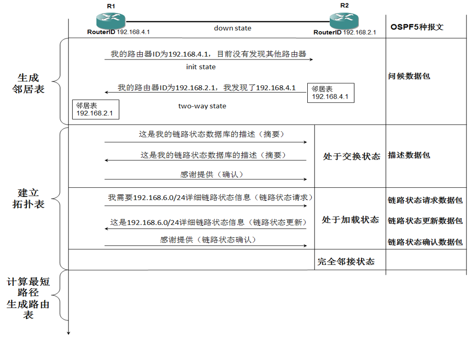

# RIP(Routing Information Protocol)路由信息协议
路由信息协议RIP（Routing Information Protocol）是一个真正的距离矢量路由选择协议。

它每隔30秒就送出自己完整的路由表到所有激活的接口。

RIP协议选择最佳路径的标准就是跳数，认为到达目标网络经过的路由器最少的路径就是最佳路径。

默认它所允许的最大跳数为15跳，也就是说16跳的距离将被认为是不可达的。

在小型网络中，RIP会运转良好，但是对于使用慢速WAN连接的大型网络或者安装有大量路由器的网络来说，它的效率就很低了。

## 工作原理
举例说明 192.168.10.0/24网段如何通过RIP协议通告给网络中的其他路由器的。
如果学到到一个网段有两条路径，只保留最佳路径。

# OSPF(Open Shortest Path First)协议
最短路径优先

## 术语
1. Router-ID
网络中运行OSPF协议的路由器都要有一个唯一的标识，这就是Router-ID，并且Router-ID在网络中绝对不可以有重复。

2. COST（开销）
OSPF协议选择最佳路径的标准是带宽，带宽越高计算出来的开销越低。到达目标网络的各个链路累计开销最低的，就是最佳路径。

3. 链路（Link）
就是路由器上的接口，在这里，应该指运行在OSPF进程下的接口。

4. 链路状态（Link-State）
链路状态（LSA）就是OSPF接口上的描述信息，例如接口上的IP地址，子网掩码，网络类型，Cost值等等，OSPF路由器之间交换的并不是路由表，而是链路状态（LSA）。

5. 邻居（Neighbor）
OSPF只有邻接状态才会交换LSA。

## OSPF工作过程
运行OSPF协议的路由器有3张表，邻居表、链路状态表和路由表。下面以这三张表的产生过程为线索，来分析在这个过程中，路由器发生了那些变化，从而说明OSPF协议的工作过程。

1. 生成邻居表
2. 建立拓扑表
3. 计算最短路径生成路由表

## OSPF的5种报文
* 类型1，问候（Hello）数据包，发现并建立邻接关系。
* 类型2，数据库描述（Database Description）数据包，向邻居给出自己的链路状态数据库中的所有链路状态项目的摘要信息。
* 类型3，链路状态请求（Link State Request，LSR）数据包，向对方请求某些链路状态项目的完整信息。
* 类型4，链路状态更新（Link State Update，LSU）数据包，用洪泛法对全网更新链路状态。这种数据包是最复杂的，也是OSPF协议最核心的部分。路由器使用这种数据包将其链路状态通知给相邻路由器。在OSPF中，只有LSU需要显示确认。
* 类型5，链路状态确认（Link State Acknowledgement，LSAck）数据包，对LSU做确认。
