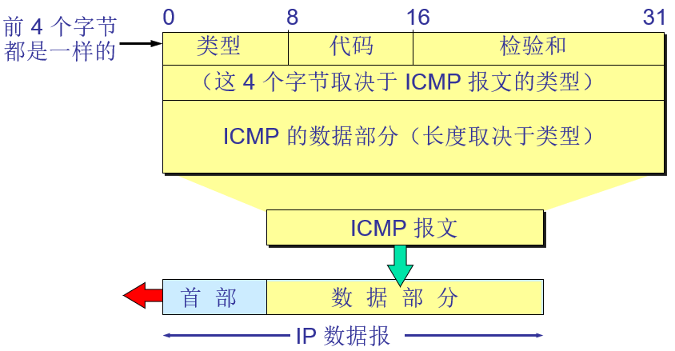
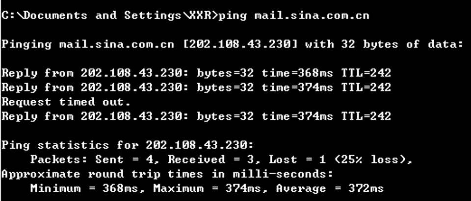
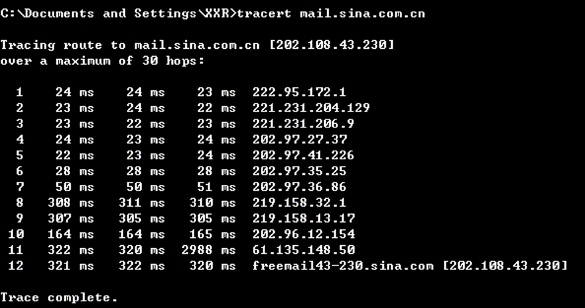

## 概念&作用
### 概念
ICMP(Internet Control Message Protocol)
网际层控制报文协议
ICMP 允许主机或路由器 **报告差错** 情况和 **提供有关异常情况的报告**。

### 作用
提高IP数据报交付成功的机会，一般有IP层或者更高层(传输层、应用层)使用。

## 报文格式

### 报文种类
#### 差错报告报文
ICMP差错报告报文共有5种
* 终点不可达
* 源点抑制
* 时间超过
* 参数问题
* 改变路由(重定向)

#### 不应发送 ICMP 差错报告报文的几种情况
* 对 ICMP **差错报告报文** 不再发送 ICMP 差错报告报文。
* 对 **第一个分片的数据报片的所有后续数据报片** 都不发送 ICMP 差错报告报文。
* 对具有 **多播地址的数据报** 都不发送 ICMP 差错报告报文。
* 对具有 **特殊地址**（如127.0.0.0 或 0.0.0.0）的数据报不发送 ICMP 差错报告报文。

#### 询问报文
ICMP询问报文共有两种：
* 回送请求和回答报文
* 时间戳请求和回答报文

## ICMP协议应用
PING 用来测试两个主机之间的连通性。

PING 使用了 ICMP 回送请求与回送回答报文。

PING 是应用层直接使用网络层 ICMP 的例子，它没有通过运输层的 TCP 或UDP。

