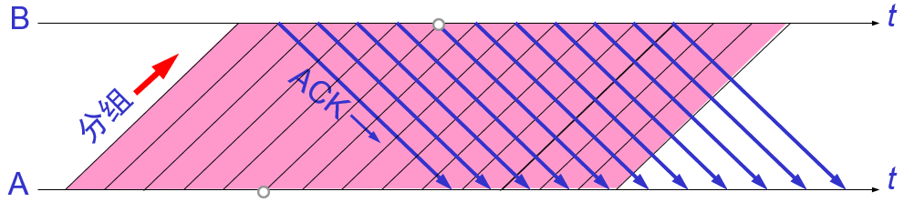

# TCP如何实现可靠传输
## ARQ(Automatic Repeat request)
### 停止等待ARQ
一个发送，一个确认
* 无差错&超时重传

* 确认丢失&确认迟到

使用上述的确认和重传机制，我们就可以 **在不可靠的传输网络上实现可靠的通信**。
这种可靠传输协议常称为 **自动重传请求ARQ (Automatic Repeat request)**。
ARQ 表明重传的请求是 **自动** 进行的。接收方不需要请求发送方重传某个出错的分组 。

#### 问题(信道利用率低)
停止等待协议的优点是 **简单** ，但缺点是 **信道利用率太低**

* 信道利用率

---

### 回退n帧的ARQ
为了解决停止等待ARQ协议 **信道利用率低的问题**， 引入 **回退n帧的ARQ**

#### 简介
发送方可 **连续发送** 多个分组，不必每发完一个分组就停顿下来等待对方的确认。

由于信道上一直有数据不间断地传送，这种传输方式可获得很高的信道利用率。

#### 累积确认
例如收到第`3`号数据，直接发送确认号`4`，就代表前`3`块数据都已经收到了。

* 优点
  * 容易实现，即使确认丢失也不必重传
* 缺点
  * 不能向发送方反映接收方已经正确收到的分组信息(例如正确收到`1,2,4`，只能确认`4`，发送方就不能判断`4`是否收到)，这种缺点又叫做 **GO-back-N(回退N)**

---

### 选择性重传ARQ
发送方不用等待接收方的应答，持续的发送多个帧，假如发现已发送的帧中有错误发生，那么发送方将只重新发送那个发生错误的帧。

---

### 混合ARQ
在混合ARQ中，数据报文传送到接收方之后，即使出错也不会被丢弃。接收方指示发送方重传出错报文的部分或者全部信息，将再次收到的报文信息与上次收到的报文信息进行合并，以恢复报文信息。

---

## 可靠传输的具体实现
* TCP 连接的每一端都必须设有两个窗口,一个 **发送窗口** 和一个 **接收窗口**。
* TCP 的可靠传输机制用字节的 **序号** 进行控制。TCP 所有的确认都是基于序号而不是基于报文段。
* TCP 两端的四个窗口经常处于 **动态变化** 之中。
* TCP连接的往返时间 RTT 也 **不是固定不变的**。需要使用特定的算法估算较为合理的重传时间。  
