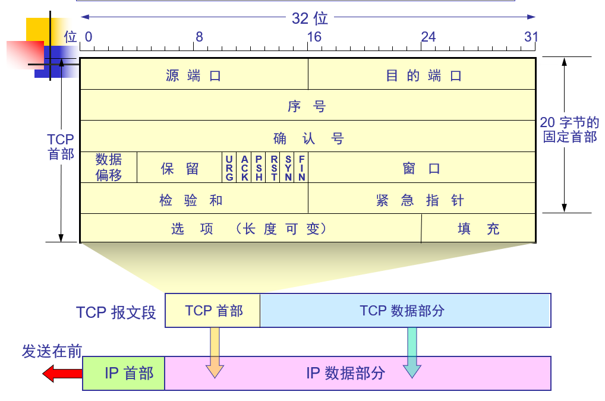

# TCP报文首部

* 源端口
* 目的端口
* 序号
  TCP协议为传输的 **每一个字节都进行编号**, 此编号指的是 **传输数据中第一个字节的数据的编号**
* 确认号
  期望对方传输的 **下一段数据第一个字节的序号**
* 数据偏移
  TCP报文 **数据部分->TCP报文段起始位置** 距离的 **字节数**， 单位是 **4个字节**
* 保留
* 标记位
  * URG
    当 URG=1 时，表明紧急指针字段有效。它告诉系统此报文段中有紧急数据，应尽快传送(相当于高优先级的数据)
  * ACK
    确认 ACK，只有当 ACK = 1 时确认号字段才有效。当 ACK = 0 时，确认号无效。TCP建立连接时，发起连接方发出的第一个请求ACK=0
  * PSH
    推送 PSH (Push)，接收 TCP 收到 PSH = 1 的报文段，就尽快地交付接收应用进程，而不再等到整个缓存都填满了后再向上交付。  
  * RST
    复位 RST (Reset), 当 RST = 1 时，表明 TCP 连接中出现严重差错（如由于主机崩溃或其他原因），必须释放连接，然后再重新建立运输连接。
  * SYN
    同步 SYN，同步 SYN = 1 表示这是一个连接请求或连接接受报文。
  * FIN
    终止 FIN (Finish)，用来释放一个连接。FIN = 1 表明此报文段的发送端的数据已发送完毕，并要求释放连接。
* 窗口
  发送窗口的大小，单位是字节
* 检验和
  检验和字段检验的范围包括首部和数据这两部分。在计算检验和时，要在 TCP 报文段的前面加上 12 字节的伪首部
* 紧急指针
  指出在本报文段中紧急数据共有多少个字节（紧急数据放在本报文段数据的最前面）
* 选项
  * MSS(Maximum Segment Size) 最大段长度
  * 窗口扩大选项 ,占 3 字节，其中有一个字节表示移位值 S。新的窗口值等于TCP 首部中的窗口位数增大到(16 + S)，相当于把窗口值向左移动 S 位后获得实际的窗口大小。
  * 时间戳选项,占10 字节，其中最主要的字段时间戳值字段（4 字节）和时间戳回送回答字段（4 字节）。
  * 选择确认选项
* 填充
  使整个首部长度是 4 字节的整数倍
