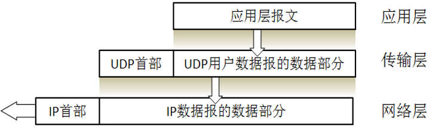

# UDP协议特点
UDP是 **无连接** 的，即发送数据之前不需要建立连接（当然发送数据结束时也没有连接可释放），因此减少了开销和发送数据之前的时延。

UDP使用 **尽最大努力交付** ，即不保证可靠交付，因此主机不需要维持复杂的连接状态表（这里面有许多参数），通信的两端不用保持连接，因此节省系统资源。

UDP是 **面向报文** 的，发送方的UDP对应用程序交下来的报文，在添加首部后就向下交付给网络层。UDP对应用层交下来的报文，既不合并，也不拆分，而是保留这些报文的边界。

UDP没有 **拥塞控制** ，因此网络出现的拥塞不会使源主机的发送速率降低。这对某些实时应用是很重要的。

UDP支持 **一对一、一对多、多对一和多对多** 的交互通信。

UDP的 **首部开销小**，只有8个字节，比TCP的20个字节的首部要短。

# UDP首部

* 伪首部
  仅仅为了计算校验和而使用
* 源端口
* 目的端口
* 长度
* 检验和
