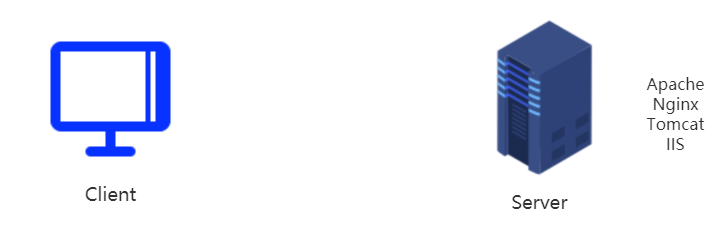
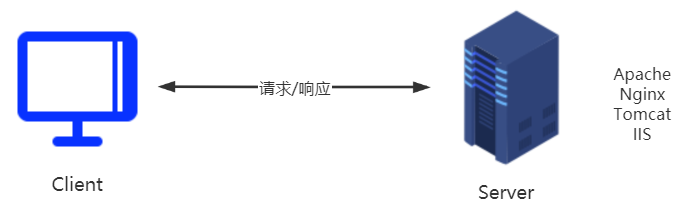

# Http协议
## 什么是协议
计算机中的协议和现实中的协议是一样的，一式双份/多份。 **双方/多方都遵从共同的一个规范, 这个规范就可以称为协议**。计算机之所以能全世界互通，协议是功不可没，如果没有协议，计算机各说各话，谁都听不懂。
如：FTP、HTTP、SMTP、POP、TCP/IP协议等。

## Http协议的工作流程
1. 原始状态(Client和Server之间没有关系)

2. 客户端请求服务器，进行通讯

3. 通讯完毕,断开连接

---
## Http的请求与相应
### 请求

### 响应
