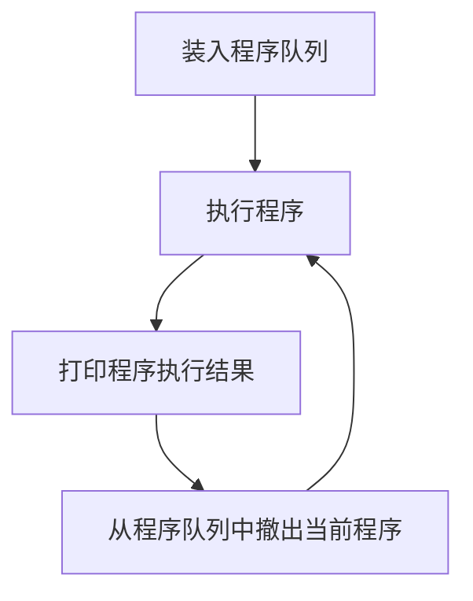

# 操作系统的发展历史
## 手工操作
程序的启动与结束都以手工的方式进行

## 单道批处理系统

## 多道批处理系统
在内存中存放多道程序,使它们在管理程序的控制下相互 **穿插地运行**。当某道程序因为某种原因 **不能继续运行下去(I/O操作)** 时，管理程序便 **将另一道程序投入运行**。这样可以使CPU和外设尽量处于忙碌状态，提高系统效率。

程序A在I/O时，程序B可以使用CPU资源。
程序B在I/O时，程序A可以使用CPU资源。

### 缺点
交互能力差：例如CPU正在处理任务时，必须等待处理完成后才能处理其他任务。

## 分时系统
将时间分成很短的 **时间片** ，将时间片 **轮流** 的分给所有任务，如果任务A在一个时间片内没有处理完任务，那么久等待 **下一个时间片**。
