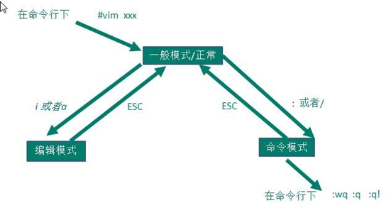

# vi&vim

## 三种模式

### 正常模式

使用vim打开文档时，就进入了正常模式。

可以使用快捷键进行 `删除、复制、粘贴` 等操作。

### 编辑模式

在正常模式中按下`i, I, o, O, a, A, r, R`中任何一个字母，就会进入到编辑模式。

### 命令行模式

此模式下可以进行 `读取、存盘、替换、离开vim、显示行号`等的操作。




## 常用命令

### 命令行模式下常用快捷键

* 复制

  ```bash
  # 复制5行内容
  5yy
  ```

* 粘贴

  ```bash
  # 粘贴复制内容
  p
  ```

* 撤销

  ```bash
  # 撤销，小写u，类似于windows crtl+z
  u
  ```

* 恢复

  ```bash
  # 恢复刚才撤销的内容
  ctrl+r
  ```

* 删除

  ```bash
  # 删除一行内容
  dd
  ```

* 设置行号

  ```bash
  # 设置行号
  :set nu
  ```

* 跳转至某行

  ```bash
  10 # 设置跳转的行号
  shift+g # 跳转
  ```

* 查找某个字符

  ```bash
  /hello # 查找hello字符
  n # 定位到下一个hello
  ```

  

