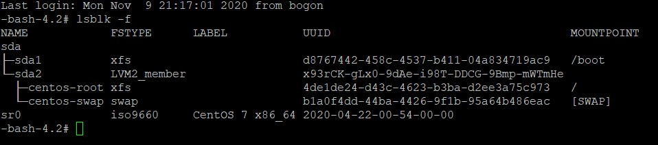
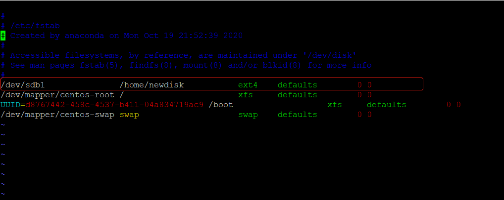

# 磁盘分区

## 分区基础知识

### 分区的方式

* mbr分区
  1. 最多支持四个主分区
  2. 系统只能安装在主分区
  3. 扩展分区要占一个主分区
  4. MBR最大支持2TB，但拥有最好的兼容性
* gtp分区
  1. 支持无限多个主分区（但操作系统可能限制，比如windows下最多128个分区）
  2. 最大支持18EB的大容量（1EB=1024PB，1PB=1024TB）
  3. windows7 64位后支持gtp

### windows下的磁盘分区


## Linux分区

### 原理介绍

1. Linux无论有几个分区，分给哪一个目录使用，它归根接地就只有一个根目录，一个独立且唯一的文件结构，**Linux中每个分区都是用来组成整个文件系统的一部分**。

2. Linux采用了一种叫 **载入** 的处理方法，将一个分区和目录联系起来。

   

### 硬盘说明

1. Linux硬盘分为`IDE硬盘` 和 `SCSI硬盘`，目前基本上是 `SCSI硬盘`。

2. 对于IDE硬盘，驱动标识符为 **hdx~**，

   - hd表明分区所在设备的类型，这里指的是IDE硬盘

   - x为盘号（a为基本盘，b为基本从属盘，c为辅助主盘，d为辅助从属盘）

   - ~代表分区，前四个分区用数字1到4表示，它们是主分区或扩展分区，从5开始就是逻辑分区。

     例如：hda3表示为第一个IDE硬盘上的第3个主分区或扩展分区

     ​				hdb2表示为第二个IDE硬盘上的第二个主分区或扩展分区

3. 对于SCSI硬盘则标识为 **sdx~**，SCSI硬盘是用 **sd**来表示分区所在设备的类型的，其余则和IDE硬盘的表示方法一样。

### 查看系统分区（lsblk）

```bash
lsblk -f
```



| NAME                                            | FSTYPE   | UUID | MOUNTPOINT |
| ----------------------------------------------- | -------- | ---- | ---------- |
| 分区情况(第1个SCSI硬盘的第一个主分区或扩展分区) | 分区类型 | UUID | 挂载点     |

## 挂载的经典案例

**新增一块2GB的磁盘，挂载到/home/newdisk目录下**

1. 虚拟机添加硬盘，然后重启，使用`lsblk -f`指令可以看到 **sdb**硬盘

2. 分区

   ```bash
   # 分区
   fdisk /dev/sdb
   # m	显示命令列表
   # p	显示磁盘分区 同 fdisk	–l
   # n	新增分区
   # d	删除分区
   # w	写入并退出
   # 按多次回车选择默认选项，等待分区完成
   ```

   再次使用`lsblk -f`可以看到 **sdb**下有一个 **sdb1**。

3. 格式化

   `mkfs -t ext4 /dev/sdb1`

   其中 **ext4** 是分区类型

   再次使用`lsblk -f`可以看到 **sdb1**产生了UUID。

4. 挂载

   挂载命令：

   - mout 设备名称 挂载目录
   - unmout 设备名称 或者 挂载目录
   - 创建`/home/newdisk`目录
   - 挂载 `mount /dev/sdb1 /home/newdisk`

   再次使用`lsblk -f`可以看到 **sdb1**挂载到了 **/home/newdisk**下

5. 设置永久挂载

   **设置永久挂载需要修改/etc/fstab文件**

   

# 磁盘情况查询

## 查询系统整体磁盘使用情况

* 基本语法

  df -h

* 应用实例

  ```bash
  # 查看系统整体磁盘使用情况
  df -h
  ```

## 查看指定目录的磁盘占用情况

* 基本语法
  - du -h /目录 (查询指定目录的磁盘使用情况，默认为当前目录)

* 参数说明

  | 参数          | 含义                       |
  | ------------- | -------------------------- |
  | -s            | 指定目录占用大小汇总       |
  | -h            | 带计量单位                 |
  | -a            | 含文件                     |
  | --max-depth=1 | 子目录深度                 |
  | -c            | 列出明细的同时，增加汇总值 |

* 应用实例

  ```bash
  # 查看/opt目录的磁盘占用情况,深度为1
  du -ach --max-depth=1 /opt
  ```

## 磁盘实用指令

1. 统计/home文件夹下的文件的个数

   `ls -l /home | grep "^-" | wc -l`

2. 统计/home文件下的目录的个数

   `ls -l /home | grep "^d" | wc -l`

3. 统计/home文件夹下文件的个数，包括子文件夹里的

   `ls -lR /home | grep "^-" | wc -l`

4. 统计文件夹下的目录数，包括子文件夹里的

   `ls -lR /home | grep "^d" | wc -l`

5. 以树状显示目录结构

   `tree`