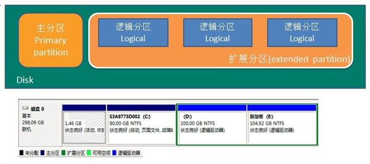
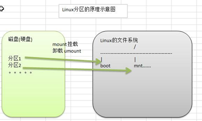

# 磁盘分区

## 分区基础知识

### 分区的方式

* mbr分区
  1. 最多支持四个主分区
  2. 系统只能安装在主分区
  3. 扩展分区要占一个主分区
  4. MBR最大支持2TB，但拥有最好的兼容性
* gtp分区
  1. 支持无限多个主分区（但操作系统可能限制，比如windows下最多128个分区）
  2. 最大支持18EB的大容量（1EB=1024PB，1PB=1024TB）
  3. windows7 64位后支持gtp

### windows下的磁盘分区

## Linux分区

### 原理介绍

1. Linux无论有几个分区，分给哪一个目录使用，它归根接地就只有一个根目录，一个独立且唯一的文件结构，**Linux中每个分区都是用来组成整个文件系统的一部分**。

2. Linux采用了一种叫 **载入** 的处理方法，将一个分区和目录联系起来。

   

### 硬盘说明

1. Linux硬盘分为`IDE硬盘` 和 `SCSI硬盘`，目前基本上是 `SCSI硬盘`。

2. 对于IDE硬盘，驱动标识符为 **hdx~**，

   - hd表明分区所在设备的类型，这里指的是IDE硬盘

   - x为盘号（a为基本盘，b为基本从属盘，c为辅助主盘，d为辅助从属盘）

   - ~代表分区，前四个分区用数字1到4表示，它们是主分区或扩展分区，从5开始就是逻辑分区。

     例如：hda3表示为第一个IDE硬盘上的第3个主分区或扩展分区

     ​				hdb2表示为第二个IDE硬盘上的第二个主分区或扩展分区

3. 对于SCSI硬盘则标识为 **sdx~**，SCSI硬盘是用 **sd**来表示分区所在设备的类型的，其余则和IDE硬盘的表示方法一样。

### lsblk

## 挂载的经典案例

### 如何增加一块硬盘

### 具体操作步骤