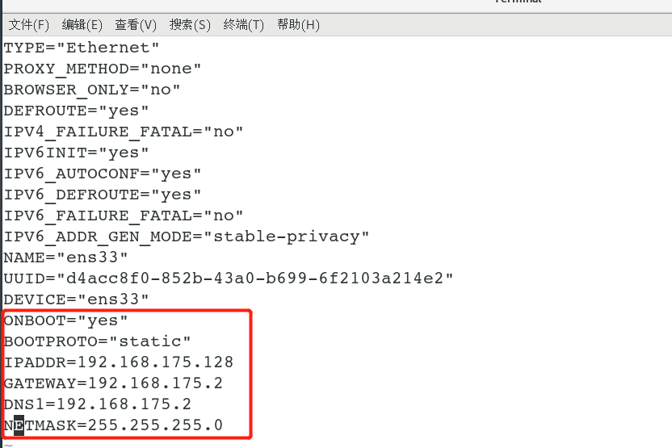

# 网络配置

## 设置固定IP

**要求：** 将ip地址配置为静态的，改为 **192.168.175.128**

```bash
# 编辑配置文件
vim /etc/sysconfig/network-scripts/ifcfg-ens33 
```



```bash
# 重启网络服务生效
systemctl restart network
# 也可以重启机器
reboot
```

