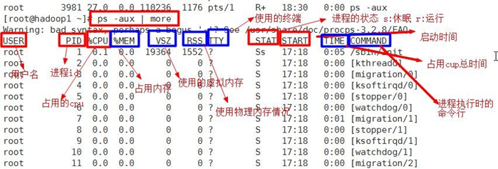
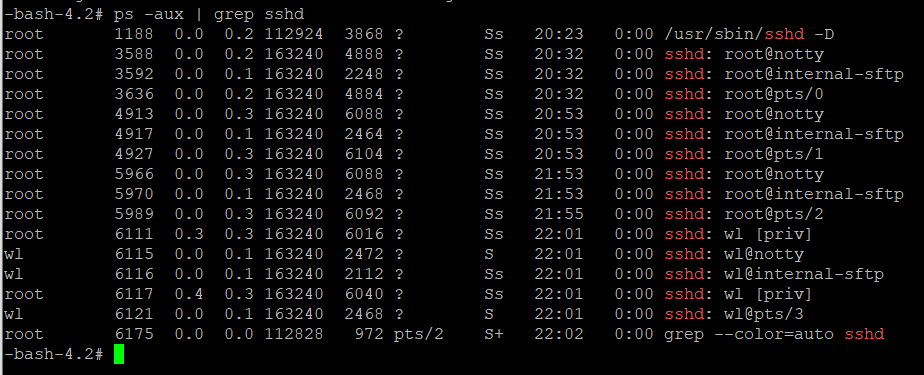
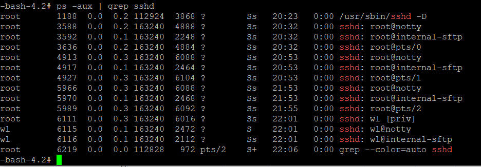
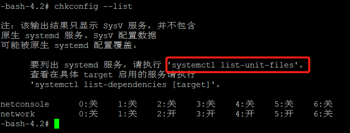

# 进程管理

## 基本介绍

1. 在linux中，**每个执行的程序都称为一个进程**。每一个进程都分配一个Id号，称之为pid。
2. **每一个进程，都会有一个父进程**，而这个父进程可以复制多个子进程。例如www服务器。
3. **每个进程都能以两种方式存在，前台或后台**，所谓前台进程就是用户目前的屏幕上可以进行操作的。后台进程则是实际在操作，但是当前屏幕上无法看到。启动服务通常以后台方式执行。
4. 一般系统的服务都是以后台进程的方式存在，而且都会常驻在系统中。直到关机才结束。

## 显示系统执行的进程

### 基本介绍

查看进程使用的指令是`ps`，一般来说使用的参数是`ps -aux`

- -a：显示当前终端的所有进程信息
- -u：以用户的格式显示进程信息
- -x：显示后台进程运行的参数

`ps -aux | grep xxx`，比如可以看看有没有sshd服务



### ps指令详解

* `ps -aux`

  System V展示风格：

  | 列      | 含义                         |
  | ------- | ---------------------------- |
  | USER    | 用户名                       |
  | PID     | 进程Id                       |
  | %CPU    | 占用的CPU                    |
  | %MEM    | 占用的内存                   |
  | VSZ     | 使用的虚拟内存               |
  | RSS     | 使用的物理内存               |
  | TTY     | 使用的终端                   |
  | STAT    | 进程的状态，s：休眠，r：运行 |
  | START   | 启动时间                     |
  | TIME    | 占用CPU的总时间              |
  | COMMAND | 进程执行时候的命令行         |

* `ps -ef`：以全格式显示当前所有的进程

  -e：显示所有进程

  -f：全格式

  BSD风格

  | 列    | 含义                                                         |
  | ----- | ------------------------------------------------------------ |
  | UID   | 用户Id                                                       |
  | PID   | 进程ID                                                       |
  | PPID  | 父进程ID                                                     |
  | C     | CPU用于计算执行优先级的因子。数值越大，表明进程是CPU密集型运算，执行优先级会降低；数值越小，表示进程是I/O密集型运算，执行优先级会提高 |
  | STIME | 进程启动的时间                                               |
  | TTY   | 完整的终端名称                                               |
  | TIME  | CPU时间                                                      |
  | CMD   | 启动进程所用的命令和参数                                     |

## 终止进程

### 基本语法

- kill [选项] 进程号 (功能描述：通过进程号杀死进程)
- killall 进程名称 (功能描述：通过进程名杀死进程，也支持通配符，这在系统因负载过大而变得很慢时很有用)

### 常用选项

- -9：表示强迫进程立即停止

### 最佳实践

1. **案例一：踢掉某个非法登录用户**

   * 查看sshd进程

     

   * 终止进程

     `kill 6121`

2. **案例2：终止远程登录服务sshd，在适当时候再次重启sshd服务**

   * 查找sshd进程

     

   * 终止进程

     `kill 1188`

3. **案例3：终止多个gedit编辑器【killall：通过进程名来终止进程】**

   `killall gedit`

4. **案例4：强制杀掉一个终端**

## 查看进程树

### 基本语法

- pstree [选项]，可以更加直观的来看进程信息

### 常用选项

- -p：显示进程的PID
- -u：显示进程的所属用户

### 应用实例

* **案例1：请以树状的形式显示进程的pid**

  `pstree -p`

## 服务管理

### 基本介绍

​	服务(service)本质就是进程，但是是运行在后台的，通常都会监听某个端口，等待其他程序的请求。

​	比如（mysql，sshd防火墙等），因此我们又称为守护进程。

### 服务的管理指令

`systemctl [start | stop | restart | reload | status] 服务名`

### 应用实例

**实例一：关闭防火墙**

```bash
# 关闭防火墙
systemctl stop firewalld
# 打开防火墙
systemctl start firewalld
```

使用这种方式关闭防火墙只是**临时关闭**，当再次重启后，防火墙还是会自动打开

### 查看所有服务名

`systemctl list-unit-files`

### 服务的运行级别

查看或修改默认级别：vi /etc/inittab

Linux 系统有 7 种运行级别(runlevel)：常用的是级别 3 和 5

* 运行级别 0：系统停机状态，系统默认运行级别不能设为 0，否则不能正常启动
*  运行级别 1：单用户工作状态，root 权限，用于系统维护，禁止远程登陆
* 运行级别 2：多用户状态(没有 NFS)，不支持网络
* 运行级别 3：完全的多用户状态(有 NFS)，登陆后进入控制台命令行模式
*  运行级别 4：系统未使用，保留
* 运行级别 5：X11 控制台，登陆后进入图形 GUI 模式
* 运行级别 6：系统正常关闭并重启，默认运行级别不能设为 6，否则不能正常启动

### 开机流程说明

>开机 =》 BIOS =》 /boot =》init进程1 =》运行级别 =》运行对应的服务

### chkconfig指令

#### 基本介绍

通过chkconfig 命令可以给每个服务的各个运行级别 **设置自启动/关闭**

#### 基本语法

* 查看服务 chkconfig --list

  

* 打开/关闭服务 chkconfig --level 5 服务名 on/off

  ```bash
  chkconfig --level 5 sshd off
  ```

**chkconfig 设置服务启动或关闭，需要重启后才能生效**

## 动态监控进程

top 与 ps 命令很相似。它们都用来显示正在执行的进程。Top 与 ps 最大的不同之处，在于 **top 在执行一段时间可以更新正在运行的的进程**。

### 基本语法

top [选项]

### 选项说明

| 选项    | 功能                                                         |
| ------- | ------------------------------------------------------------ |
| -d 秒数 | 指定top命令每隔几秒更新。默认是3秒在top命令的交互模式当中可以执行的命令 |
| -i      | 使top不显示任何闲置或僵死的进程                              |
| -p      | 通过指定监控进程ID来仅仅监控某个进程的状态                   |

交互操作说明：

| 操作 | 功能                          |
| ---- | ----------------------------- |
| P    | 以CPU使用率排序，默认就是此项 |
| M    | 以内存的使用率排序            |
| N    | 以PID排序                     |
| q    | 退出top                       |

### 应用实例

**案例一：监视特定用户**

```bash
# 输入top命令，按回车键，查看进行的进程
top
# 然后输入u,输入用户名，按回车即可
u
```

**案例二：指定系统状态更新的时间（每隔10秒自动更新，默认是3秒）**

```bash
top -d 10
```

## 查看系统网络情况

### 基本语法

* netstat [选项]
* netstat -anp

### 选项说明

-an 按一定顺序排列输出

-p 显示哪个进程在调用

### 应用案例

**案例一：查看系统所有的网络服务**

```bash
netstat -anp | more
```

**案例二：查看服务名为sshd的服务的信息**

```bash
netstat -anp | grep sshd
```

