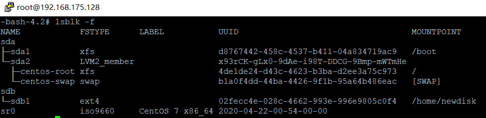
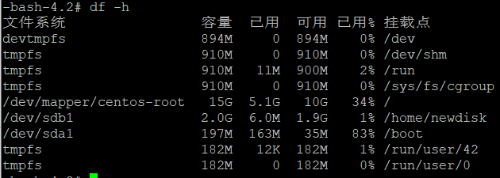
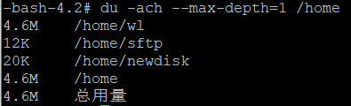

# linux目录结构

| 目录 | 作用                                        |
| ---- | ------------------------------------------- |
| /dev | 是device的意思，该目录下存储linux的外部设备 |
| /mnt | 用户临时挂载别的文件系统的目录              |
|/proc|是processes的缩写，是系统内存的映射|
|/run|存储系统启动以来的信息，重启会被删除|
|/srv|存储对外提供服务的文件，如：web页面，后台服务|
|/tmp|用来存储临时文件，可直接删除，如软件的压缩包|
|/var|用来存储缓存文件，如日志、数据库文件等|
|/media|linux识别u盘、光驱等设备后，会把识别的设备挂载到这个目录下|
|/opt|optinal的缩写，用于安装大型的可选软件，如游戏等，相当于windows下的d:/software|
|/usr|用于存放比较重要软件的安装文件，相当于windows下的c:/programfiles|

# vi&vim

| 功能 | 命令 |
| ---- | ---- |
| 复制|5yy(复制5行)|
| 粘贴|p|
| 撤销|u|
| 恢复|ctrl+r|
| 删除 |dd|
| 设置行号 |:set nu|
| 跳转至某行| 10 shif+g(跳转至第10行)|
| 查找某个字符| /hello (查找hello字符) n (定位到下一个hello)|

# 实用指令

| 功能     | 命令            |
| -------- | --------------- |
| 立即关机 | shutdown -h now |

## 帮助指令

| 功能                 | 命令    |
| -------------------- | ------- |
| 获取ls指令的帮助信息 | man ls  |
| 获取cd指令的帮助信息 | help cd |

## 文件目录类

| 功能                                               | 命令                                                         |
| -------------------------------------------------- | ------------------------------------------------------------ |
| 创建多级目录                                       | mkdir -p /tmp/animal/tiger                                   |
| 递归的将/tmp/animal 目录拷贝到/tmp/zoo下           | cp -r /tmp/animal /tmp/zoo                                   |
| 重命名文件(hellowrold.java重命名为HelloWorld.java) | mv /tmp/helloworld.java /tmp/HelloWorld.java                 |
| 将/tmp/animal移动到/tmp/zoo/animal                 | mv /tmp/animal /tmp/zoo/animal                               |
| 以显示行号的方式查看文件                           | cat -n /etc/profile                                          |
| 分页方式查看文件(翻页)                             | more /etc/profile下翻页：空格/(crtl+f)，上翻页：crtl+b，下一行：回车) |
| 分页方式查看大文件(翻页、向上/下查找)              | less /etc/services 上翻页:pageup，下翻页：pagedown，查找字符串：/字符串，n：向下查找，N：向上查找 |
| 输出重定向                                         | `>`  会覆盖原来的内容                                        |
| 追加内容                                           | >>                                                           |
| 查看最后5行的内容                                  | tail -n 5 /etc/profile                                       |
| 创建软连接linkToRoot,连接到/root目录               | ln -s /root /tmp/linkToRoot （删除软连接时不要删除/tmp/linkToRoot/ ，应该删除/tmp/linkToRoot） |
| 设置系统当前时间                                   | date -s "2020-10-10 20:56:00"                                |
| 在/tmp目录下查找名字为*.txt的文件                  | find /tmp -name *.txt                                        |
| 查找/tmp下的属于root用户的文件                     | find /tmp -user root                                         |
| 查找/下文件大小大于20M的文件                       | find / -size +20M （+表示大于,-小于,无符号等于）             |
| 解压z.zip到zz目录下                                | unzip -d /tmp/zz /tmp/z.zip                                  |
| 将a1.txt和a2.txt压缩成a.tar.gz                     | tar -zcvf a.tar.gz a1.txt a2.txt                             |
| 将test文件夹压缩成test.tar.gz                      | tar -zcvf test.tar.gz test                                   |
| 将test.tar.gz解压到test下                          | tar -zxvf test.tar.gz -C test                                |
| tar命令参数                                        | -c：产生.tar打包文件 	-v：显示详细信息	-f：指定压缩后的文件名 -x：解包 |

# 磁盘指令

| 功能                                    | 命令                                                         |
| --------------------------------------- | ------------------------------------------------------------ |
| 查看系统分区情况                        | lsblk -f |
| 查看系统整体磁盘使用情况                | df -h |
| 查看指定目录的磁盘占用情况              | du -h                                                        |
| 查看/home目录下的一级目录的磁盘占用情况 | du -ach --max-depth=1 /home |
|                                         |                                                              |

# 进程管理

| 功能                           | 命令                      |
| ------------------------------ | ------------------------- |
| 查看是否存在sshd服务           | ps -aux \| grep sshd      |
| 查看所有服务名                 | systemctl list-unit-files |
| 动态监控进程（每10秒自动更新） | top -d 10                 |
| 查看服务sshd的网络情况         | netstat -anp \| grep sshd |

# rpm&yum

| 功能                         | 命令                     |
| ---------------------------- | ------------------------ |
| 查看linux有没有安装firefox   | rpm -qa \| grep firefox  |
| 查看软件包安装到了什么地方   | rpm -ql 软件包名         |
| 删除firefox                  | rpm -e firefox           |
| 通过.rpm安装包安装firefox    | rpm -ivh firefox.rpm     |
| 查看yum服务器是否存在firefox | yum list \| grep firefox |
| 从yum服务器安装firefox       | yum install firefox      |