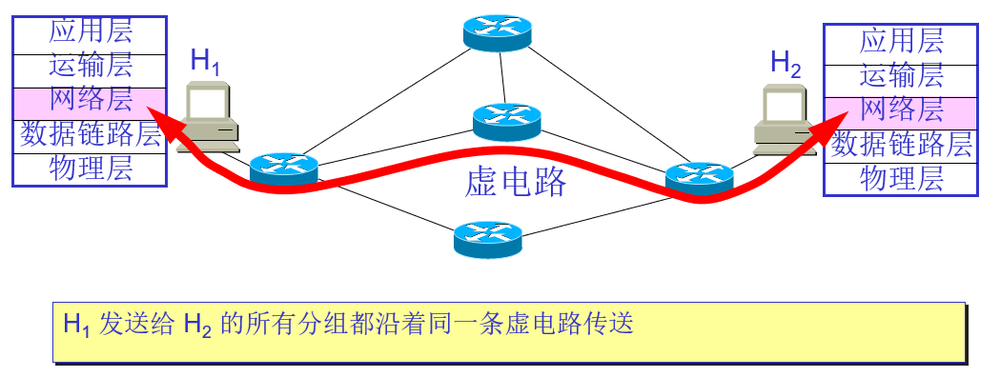
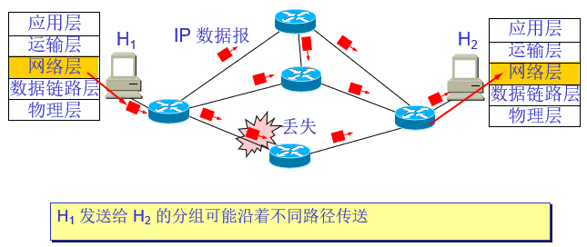

# 网络层提供的两种服务
网络层关注的是如何**将分组从源端沿着网络路径送达到目的地**

在计算机网络领域，网络层应该向运输层提供怎样的服务(“面向连接 还是 无连接”)层引起了长期的争论。
争论焦点的实质：在计算机通信中，**可靠交付应当有谁来负责**，是**网络**还是端系统。

网络层向运输层提供的两种服务：
* 虚电路服务:面向连接的可靠服务
* 数据报服务：无连接的不可靠服务

## 虚电路服务

虚电路表示这只是一条**逻辑上的连接**

分组都沿着这条逻辑连接按照存储转发方式传送，而并不是真正建立了一条物理连接。

请注意，电路交换的电话通信是先建立了一条**真正的连接**。因此分组交换的虚连接和电路交换的连接只是类似，但并不完全一样。

## 数据报服务

简单灵活的、**无连接的**、**尽最大努力交付** 的 **数据报**服务。

网络在发送分组时不需要先建立连接。每一个分组（即 IP 数据报）独立发送，与其前后的分组无关（不进行编号）。

网络层不提供服务质量的承诺。即所传送的分组**可能出错、丢失、重复和失序**（不按序到达终点），当然也**不保证分组传送的时限**。

## 尽最大努力交付的好处：
* 由于传输网络不提供端到端的可靠传输服务，这就使网络中的**路由器可以做得比较简单，而且价格低廉**（与电信网的交换机相比较）。
* 如果主机（即端系统）中的进程之间的通信需要是可靠的，那么就由网络的主机中的运输层负责（包括差错处理、流量控制等）。
* 采用这种设计思路的好处是：网络的**造价大大降低**，**运行方式灵活**，能够适应多种应用。

## 虚电路服务与数据报服务的比较
| 对比的方面 | 虚电路服务 | 数据报服务 |
| --------- | --------- | --------- |
| 思路 | 可靠通信应当由网络来保证 | 可靠通信应当由用户主机来保证 |
| 连接的建立 | 必须有 | 不需要 |
| 终点地址 | 仅在连接建立阶段使用，每个分组使用短的虚电路号 | 每个分组都有终点的完整地址 |
| 分组的转发 | 属于同一条虚电路的分组均按照同一路由进行转发 | 每个分组独立选择路由进行转发 |
| 当结点出故障时 | 所有通过出故障的结点的虚电路均不能工作 | 出故障的结点可能会丢失分组，一些路由可能会发生变化 |
| 分组的顺序 | 总是按发送顺序到达终点 | 到达终点时不一定按发送顺序 |
| 端到端的差错处理和流量控制 | 可以由网络负责，也可以由用户主机负责 | 由用户主机负责 |
