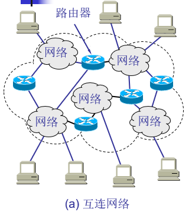
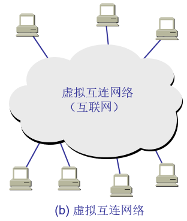
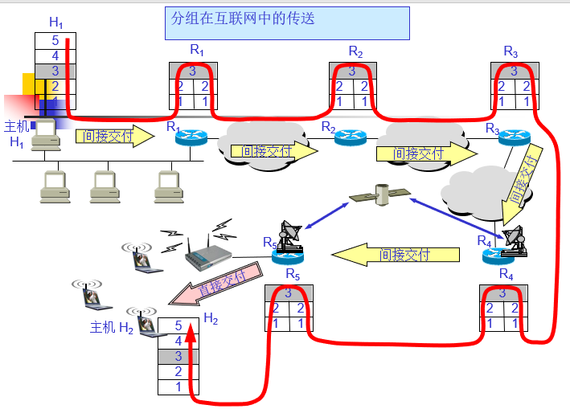

# 虚拟互联网
## 网络互连需要解决的问题
* 不同的寻址方案
* 不同的最大分组长度
* 不同的网络接入机制
* 不同的超时控制
* 不同的差错恢复方法
* 不同的状态报告方法
* 不同的路由选择技术
* 不同的用户接入控制
* 不同的服务（面向连接服务和无连接服务）
* 不同的管理与控制方式

## 网络互连的设备
中间设备又称为中间系统或中继(relay)系统。
* 物理层中继系统：转发器(repeater)。如：交换机
* 数据链路层中继系统：网桥或桥接器(bridge)。
* 网络层中继系统：路由器(router)。
* 网络层以上的中继系统：网管(gateway)。

## 何为网络
当中继系统是**转发器**或**网桥**时，一般并不称之为**网络互连**，因为这仅仅是把一个网络扩大了，而这仍然是一个网络。

网关由于比较复杂，目前使用得较少。

互联网都是指**用路由器进行互连的网络**。

由于历史的原因，许多有关 TCP/IP 的文献将网络层使用的路由器称为网关。

## 互连网络&虚拟互连网络
### 互连网络

### 虚拟互连网络

### 虚拟互连网络的意义
所谓虚拟互连网络也就是逻辑互连网络，它的意思就是互连起来的各种物理网络的异构性本来是客观存在的，但是我们利用 IP 协议就可以使这些性能各异的网络从用户看起来好像是一个统一的网络。

使用 IP 协议的虚拟互连网络可简称为 IP 网。

使用虚拟互连网络的好处是：当互联网上的主机进行通信时，就好像在一个网络上通信一样，而看不见互连的各具体的网络异构细节

# 分组在互联网中的传送

