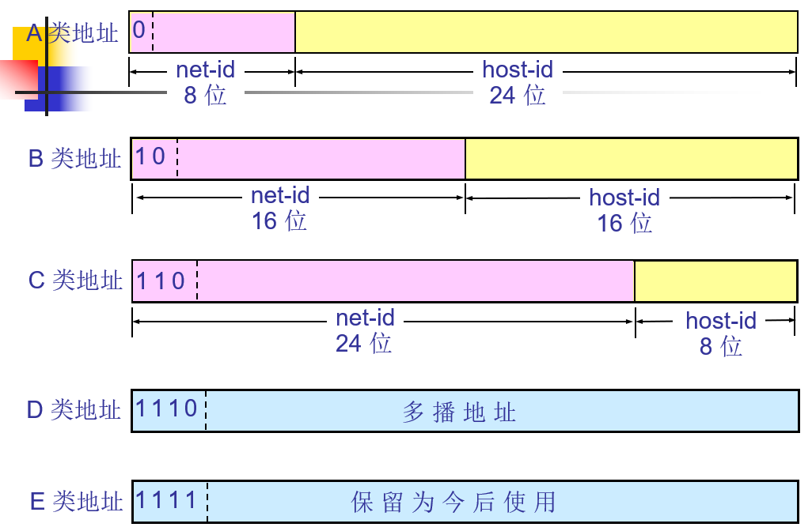
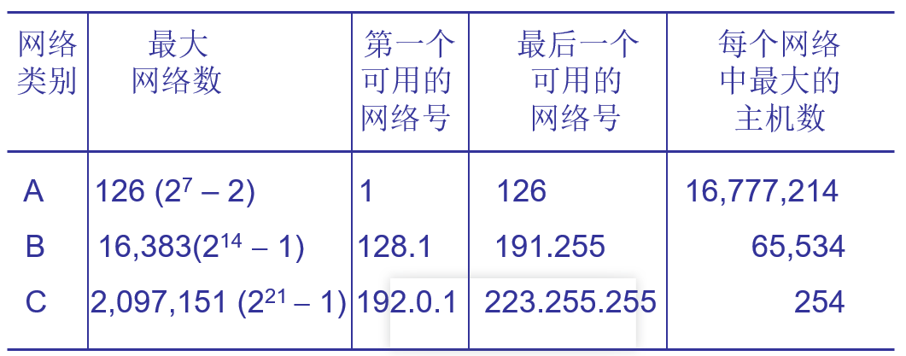

# IP地址
IPV4地址用32位二进制表示。

## IP地址的分类
IP地址=网络号+主机号

### 常用的三种类别的 IP 地址

## IP地址的重要特点
1. IP 地址是一种**分等级的地址结构**。分两个等级的好处是：
    * 第一，IP 地址管理机构在分配 IP 地址时只分配网络号，而剩下的**主机号则由得到该网络号的单位自行分配**。这样就**方便了 IP 地址的管理**。
    * 第二，路由器仅根据目的主机所连接的**网络号**来转发分组（而不考虑目的主机号），这样就可以**使路由表中的项目数大幅度减少**，从而减小了路由表所占的存储空间。
2. 实际上 IP 地址是标志**一个主机（或路由器）和一条链路的接口**。
    * 当一个主机同时连接到两个网络上时，该主机就必须同时具有两个相应的 IP 地址，其网络号 net-id 必须是不同的。这种主机称为 **多归属主机(multihomed host)**。
    * 由于一个路由器至少应当连接到两个网络（这样它才能将 IP 数据报从一个网络转发到另一个网络），因此一个路由器至少应当有两个不同的 IP 地址。
3. 用转发器或网桥连接起来的若干个局域网仍为一个网络，因此这些局域网都具有同样的网络号 net-id。
4.  所有分配到网络号 net-id 的网络，范围很小的局域网，还是可能覆盖很大地理范围的广域网，都是平等的。

## 特殊的IP地址
* 本地环回地址 127.0.0.1
* 无法自动获得IP地址时分配的地址 169.254.0.0
* 保留的私网地址
  10.0.0.0
  172.16.0.0-172.31.0.0
  192.168.0.0-192.168.255.0
