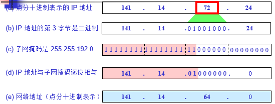
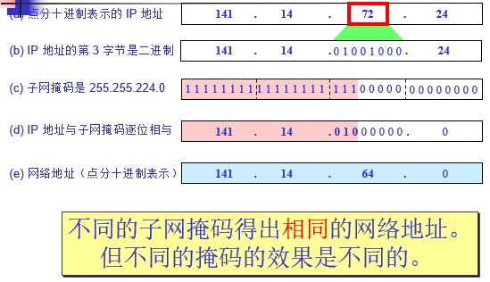

# 子网掩码&子网划分
## 子网掩码
从一个 IP 数据报的首部并**无法判断**源主机或目的主机所连接的网络是否进行了子网划分。

使用**子网掩码**(subnet mask)可以找出 IP 地址中的子网部分。

### 默认子网掩码
* A类地址(255.0.0.0)
* B类地址(255.255.0.0)
* C类地址(255.255.255.0)

## 子网划分
划分子网的作用主要是为了**提高IP地址的利用率**。
例如有一个C类地址的网段`192.168.x.x`，现有200台机器，要划分成两个网段。
* 显然可以划分为`192.168.1.x`和`192.168.2.x`，但是这样划分比较浪费。
* 实际上只需要划分为`(192.168.1.1~192.168.1.126)`和`(192.168.1.129~192.168.1.254)`即可。

### 划分两段子网
现有网段`192.168.1.x`，有机器200台，将100台划分到一个网段，将另外100台划分到另一个网段。
```
子网掩码：192.168.1.128
网段1：192.168.1.1~192.168.1.126
网段2：192.168.1.129~192.168.1.254
```

### 划分4段子网
现有网段`192.168.1.x`，有机器200台，将50台为一个网段划分到不同的网段中。
```
子网掩码：192.168.1.192
网段1：192.168.1.1~192.168.1.62
网段2：192.168.1.65~192.168.1.126
网段3：192.168.1.129~192.168.1.190
网段3：192.168.1.193~192.168.1.254
```

### 点到点
```
子网掩码：192.168.1.252
网段1：192.168.1.249~192.168.1.250
网段2：192.168.1.253~192.168.1.254
```

### 不等长的划分
现有网段`192.168.1.x`，有机器200台，将100台划分到1个网段，将50台划分到1个网段，将30台划分到1个网段，将20台划分到一个网段
```
100台机器：
网段1：192.168.1.1~192.168.1.126
子网掩码：192.168.1.128

50台机器：
网段2：192.168.1.129~192.168.1.190
子网掩码：192.168.1.192

30台机器：
网段3：192.168.1.193~192.168.1.222
子网掩码：192.168.1.224

20台机器：
网段4：192.168.1.225~192.168.1.254
子网掩码：192.168.1.224
```

## 例题
已知 IP 地址是 `141.14.72.24`，子网掩码是 `255.255.192.0`。试求网络地址。


在上例中，若子网掩码改为255.255.224.0。试求网络地址，讨论所得结果。


**例1中将网段划分为4个子网，而例2中将网络划分为8个子网**
