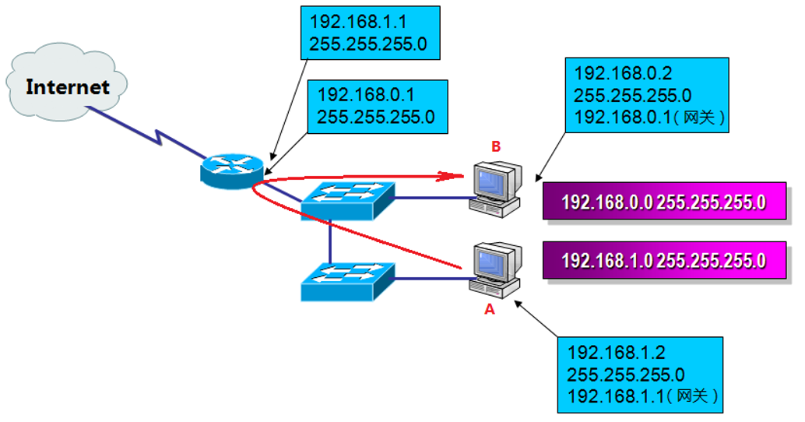
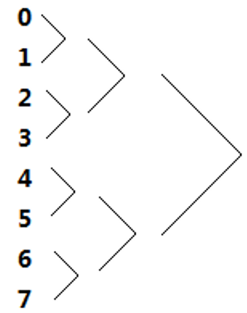

# 超网
为了提供IP地址的利用率，我们会**划分子网**，但有时候我们也需要把**小网络变成一个大的网络**，这样的操作叫做**超网**。

如上图所示：A计算机到B计算机通信，必须通过路由器转发，如图所示。
但是，这两个子网通信需要路由器转发，效率不高，因此需要进行**子网合并**

---

## 子网合并
### 子网合并步骤
1. 根据实际需求确定合适的网段
2. 确定子网掩码

### 合并两个网段
1. 确定网段(`192.168.0.x`和`192.168.1.x`)
2. 合并这两个网段则需要这两个网段的网络位相同。因此子网掩码为`255.255.254.0`。即这两个网段的网络位都为`192.168.0.x`

### 合并4个网段
1. 确定网段(`192.168.0.x`和`192.168.1.x`和`192.168.2.x``192.168.3.x`)
2. 确定子网掩码(`255.255.252.0`)。即这4个网段的网络位都为`192.168.0.x`

---

## 合并网络的规律总结

向左移动1位子网掩码可以合并0、1网络，也可以合并2、3网络，也可以合并4/5网络，也可以合并6、7网络。

向左移动2位子网掩码可以将连续的0、1、2、3网络合并成一个网络，也可以将连续的4、5、6、7网络合并成一个网络。

向左移动3位子网掩码，可以将0、1、2、3、4、5、6、7合并成一个网路。

---

## 练习
`192.168.178.0` `255.255.255.0` 和 `192.168.179.0` `255.255.255.0`这挨着的网络是否能够通过向左移动1位子网掩码合并成一个网段？

答：可以使用这样的方法：178除以4余数是2，179除以4余数是3，根据上面的介绍，2和3网络是可以通过子网掩码向左移1位，合并成一个网络。
因此这两个子网是可以合并为`192.168.178.0` `255.255.254.0`
