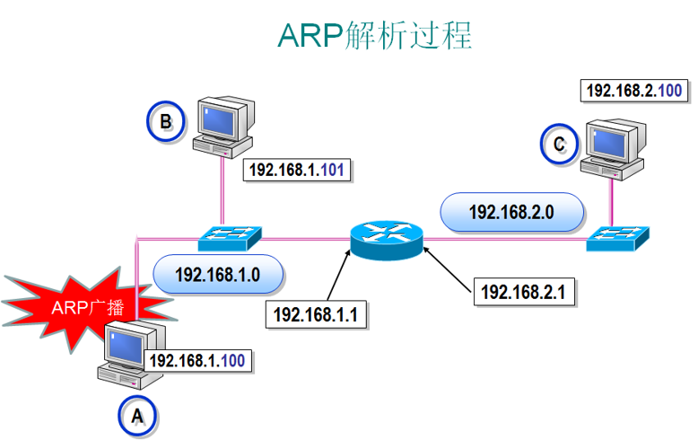

## ARP(Address Resolution Protocol)
根据`IP`地址获取物理地址的一个协议。

主机发送信息时将包含目标`IP`地址的`ARP`请求 **广播到局域网络上的所有主机**，并接收返回消息，以此 **确定目标的物理地址**；收到返回消息后将该`IP`地址和物理地址 **存入本机`ARP`缓存** 中并保留一定时间，下次请求时直接查询ARP缓存以节约资源。

A计算机向B计算机传输数据。
源地址：192.168.1.100
目标地址：192.168.1.101

A计算机先在局域网内进行 **广播**，然后接收返回消息，然后确定B计算机的 **物理地址**。

### ARP欺骗
如上图，假设A计算机在局域网内 **广播** 后，然后 **C计算机给A一个假响应**，告诉A计算机`192.168.1.101`的物理地址是C计算机，然后A计算机发给B计算机的数据都要经过C计算机，这样C计算机就可以 **截获A计算机发送给B计算机的数据**，再将数据发送给B计算机。

## RARP(Reverse Address Resolution Protocol)
从网关根据 **物理地址** 获取`IP`地址

反向地址转换协议（RARP）允许 **局域网的物理机器从网关服务器的 ARP 表或者缓存上请求其 IP 地址**。
