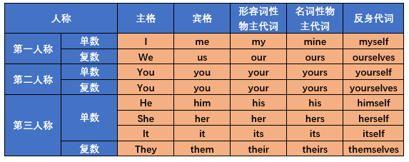

# 人称代词


## 主格：做主语
```
I love you.
Your are so beautiful.
He is my brother.
She is a nice girl.
```

## 宾格：做宾语
```
Thank you.
Do you love me?
Would you help us.
I want to talk to him.
```

## 形容词性物主代词：作定语
```
This is my book.
Thank you for your help.
That man is her husband.
His phone is lost.
```

## 名词性物主代词=形容词性物主代词+名字
```
// Mine = My shoes
Your shoes are black.Mine are yellow.

// yours = your book
This is my book.It's yours.

// hes = her handbag
This is her handbag.It's hers.

// Ours = Our car
This isn't our car.It's gray.Ours is silver.
```

## 反身代词：当宾语和主语一致时，宾语用反身代词
```
I love myself.
Don't hurt yourself.
Enjoy yourself!(玩的高兴)
Be yourself!(做你自己)
```
