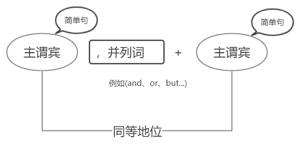
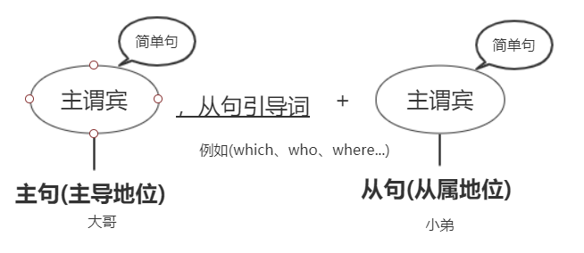

# 句式划分
## 简单句
主语 + 谓语 + 宾语

* 主语(Subject) 动作的发出者 **我**
* 谓语(Verb)    动作        **踢**
* 宾语(Object)  动作的承受者 **球**

---
## 并列句

主谓宾，并列词(and,or,but...) + 主谓宾

并列次前后的 **主谓宾** 是 **同等地位，并列关系**。

---
## 复合句

从句类型：
* 名词性从句(名词)
* 定语从句(形容词)
* 状语从句(副词)
