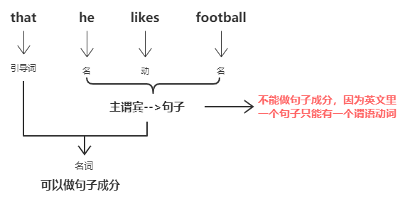

# 从句
引导词+主谓宾(或其五个兄弟)

## 名词性从句
> 主语从句
> 宾语从句
> 表语从句
> 同位语从句

这四种句子 **句型一样，只不过位置不同**， 因此名称不同
```
主           谓         宾
名词         及物动词    名词
名词性从句               名词性从句
主语从句                 宾语从句
```



### 主语从句
That he like football suprised us.

### 宾语从句
He said that he likes football.

### 表语从句
The fact is that he likes football.

### 同位语从句
首先，什么是 **同位语**？
**同位语** 起 **解释说明名词的作用**，和其所解释的名词相等，同位语是【名词】。
* 如：主，同位语，谓，宾。
同位语解释说明主语。
Yusuf, a urban man, loves spring.
* 主谓宾，同位语。
Yusuf loves spring,one of the four season.

同位语从句：主(同谓语从局)谓宾；主谓宾(同谓语从局)
The fact that he likes football suprised us.
He states the fact that he likes football.
