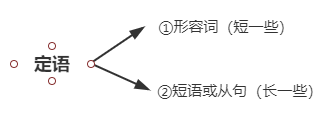
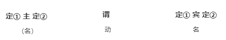

# 定语从句
* 什么是定语?
  修饰限定名词，汉语中的 **“的”前面的内容**， `红红` 的花

* 包含定语的句型
  

  定1列子： A beautiful girl shared a facinating story.
  定2例子：A girl from Mars shared a story about her people.
  定2例子2：A task to tackle is the potential cirsis. (讨论的这个任务是一个潜在的危机)
  定2列子3：A girl who likes spring shared a story which moved us.
  定2例子： A beautiful girl from Mars who likes spring shared a facinating story about her people which moved us.(一个美丽的，来自火星的，喜欢春天的女孩分享了一个迷人的，关于他的人类的，打动了我们的故事。)
