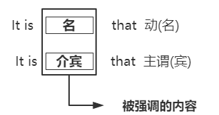
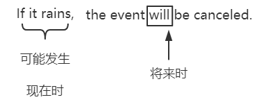
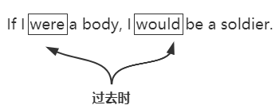

# 强调句
* 他打了我
He hit me.
* 是他打了我
It was him that hit me.

* 我通过这个网站了解了这个项目
I learned about this project through this site.
* 就是通过这个网站我才了解了这个项目
It was through this site that I learned about this project.


# 倒装句
* 正常句序：主谓(宾)
* 倒装句序：谓主(宾) **强调，加强语气的作用**

```
正常：We can win only when we try harder.
倒装：Only when we try harder can we win.

正常：We can win only through hard work.
倒装：Only through har work can we win.

正常：The bus came.
倒装：He cames the bus.

正常：The Queen live long!
倒装：Long live The Queen.
```

# 虚拟语气
* 假设一件有可能放生的事-->条件状语。


* 假设一件不可能发生的事--> **虚拟语气**
  1. 现在不可能
  
  2. 过去不可能(和既成事实相反)
  If I had studied(过去完成) English, it would have been(过去时+完成时) easier now.
  说明过去没学，现在并不简单。
  If I hadn't had(过去完成) thar extra cafe, I wouldn't have been fealing guilty.
  说明吃了，现在很有负罪感。
