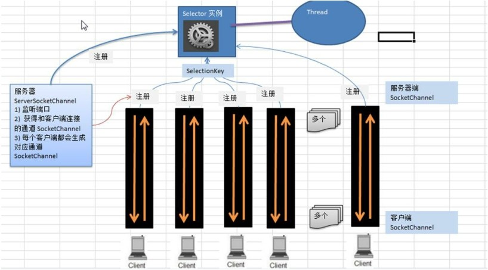

# NIO非阻塞原理
NIO  非阻塞 网络编程相关的(`Selector`、`SelectionKey`、`ServerScoketChannel` 和 `SocketChannel`) 关系梳理图

1. 当客户端连接时，会通过 `ServerSocketChannel` 得到 `SocketChannel`
2. `Selector` 进行监听，调用  `select`  方法,  返回有事件发生的通道的个数.
3. 将 `socketChannel` 注册到 `Selector` 上(`register(Selector sel, int ops)`),  一个 `selector` 上可以注册多个 `SocketChannel`
4. 注册后返回一个 `SelectionKey`, 会和该 `Selector` 关联(集合)
5. 进一步得到各个 `SelectionKey` (有事件发生`selected key`)
6. 再通过 `SelectionKey`	反向获取 `SocketChannel` ,  方法 `channel()`
7. 可以通过得到的 `channel`	, 完成业务处理
