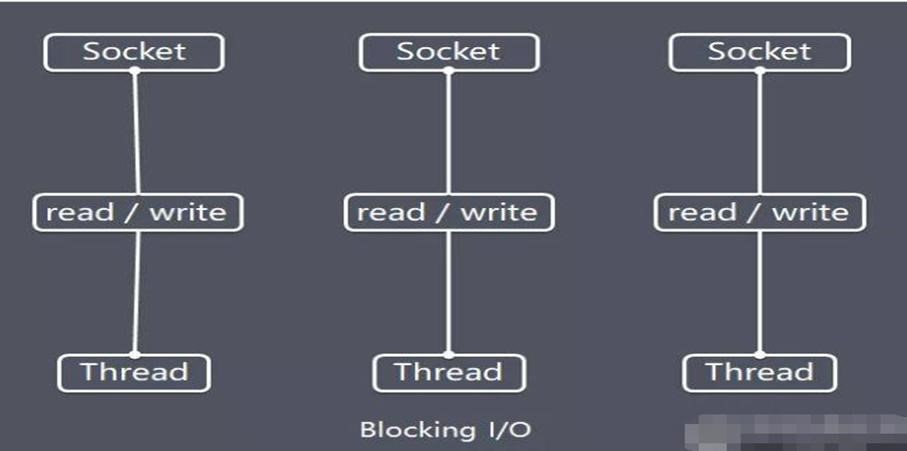

# Java BIO
## 基本介绍
Java BIO 就是传统的 java io 编程，其相关的类和接java.io下

BIO(blocking I/O) ： 同步阻塞，服务器实现模式为**一个连接一个线程**，即客户端有连接请求时服务器端就需要启动一个线程进行处理，如果这个连接不做任何事情会造成不必要的线程开销，可以通过线程池机制改善(实现多个客户连接服务器)。

BIO 方式**适用于连接数目比较小且固定的架构**，这种方式对服务器资源要求比较高，并发局限于应用中，JDK1.4以前的唯一选择，程序简单易理解

## 工作机制


## BIO应用实例
### Server
```java
public class TestServer {
	public static void main(String[] args) throws Exception {
		// 创建线程池
		ExecutorService threadPool = Executors.newCachedThreadPool();

		ServerSocket serverSocket = null;
		try {
			// 创建ServerSocket
			serverSocket = new ServerSocket(6666);
			System.out.println("Server start...");

			while (true) {
				// 与客户端建立连接
				Socket socket = serverSocket.accept();
				System.out.println("client connect..");

				threadPool.execute(() -> {
					handleClientTask(socket);
				});
			}
		} finally {
			if (serverSocket != null) {
				serverSocket.close();
			}
		}
	}

	/**
	 * 处理客户端的任务
	 *
	 * @param socket
	 *            套接字
	 */
	private static void handleClientTask(Socket socket) {
		InputStream inputStream = null;
		try {
			// 读取客户端发送的数据
			inputStream = socket.getInputStream();

			// 打印线程Id和Name
			Thread currentThread = Thread.currentThread();
			System.out.println("Thread ID：" + currentThread.getId() + "ThreadName："
					+ currentThread.getName());

			byte[] buffer = new byte[1024];
			while (true) {
				int read = inputStream.read(buffer);
				if (read != -1) {
					// 打印客户端发送的消息
					System.out.println("Client：" + new String(buffer, 0, read));
				} else {
					break;
				}
			}

			// 向客户端回执消息

		} catch (Exception e) {
			e.printStackTrace();
		} finally {
			// 释放资源
			try {
				socket.close();
				if (inputStream != null) {
					inputStream.close();
				}
			} catch (IOException e) {
				e.printStackTrace();
			}
		}
	}
}
```

### 结论
通过打印当前线程的Id和Name可以得出：**BIO为每一个客户端的连接都会分派一个线程**
