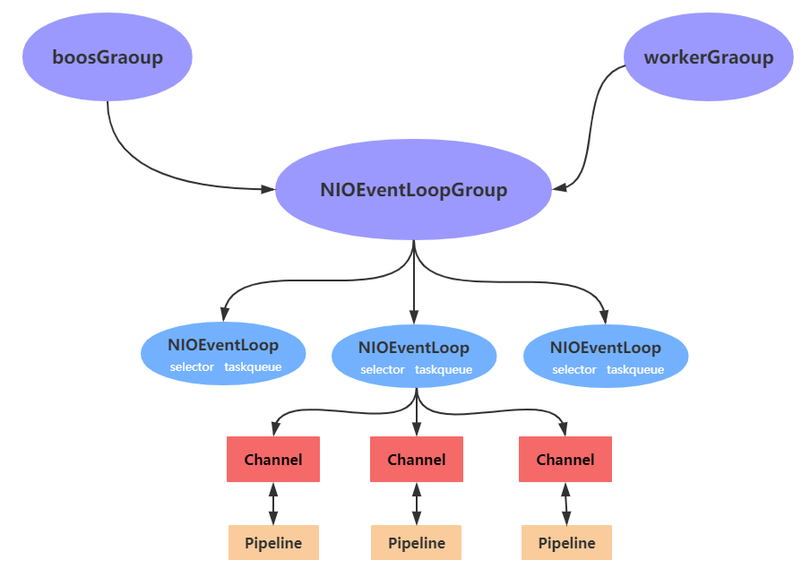

# Netty组件关系

Netty 抽象出两组线程池，`BossGroup` 专门负责**接收客户端连接**，`WorkerGroup` 专门**负责网络读写操作**。

`NioEventLoop` 表示一个**不断循环执行处理任务的线程**，每个 `NioEventLoop` 都有一个 `selector`，用于监听绑定在其上的 `socket` 网络通道。

`NioEventLoop` 内部采用串行化设计，从消息的读取->解码->处理->编码->发送，始终由 IO 线程 `NioEventLoop` 负责

`NioEventLoopGroup` 下包含多个 `NioEventLoop`
* 每个 `NioEventLoop` 中包含有一个 `Selector`，一个 `taskQueue`
* 每个 `NioEventLoop` 的 `Selector` 上可以注册监听多个 `NioChannel`
* 每个 `NioChannel` 只会绑定在唯一的 `NioEventLoop` 上
* 每个 `NioChannel`  都绑定有一个自己的 `ChannelPipeline`
